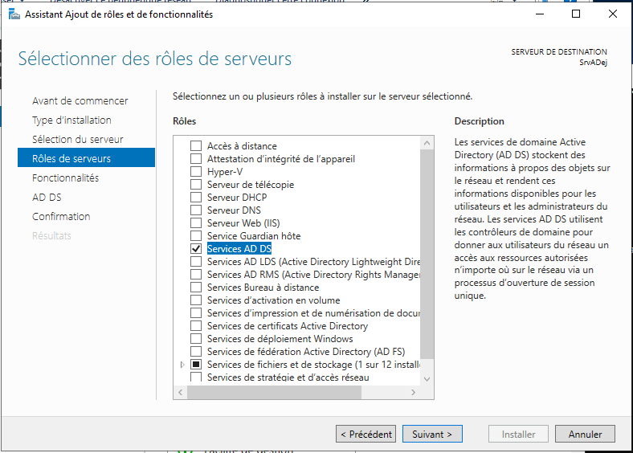
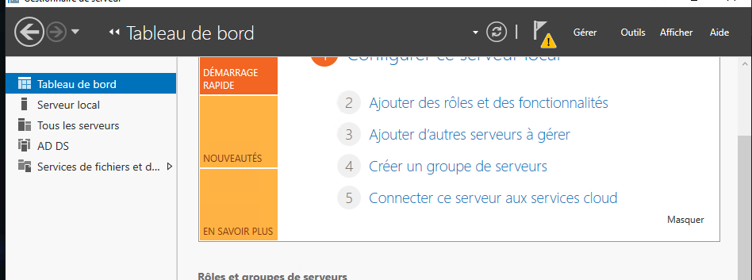
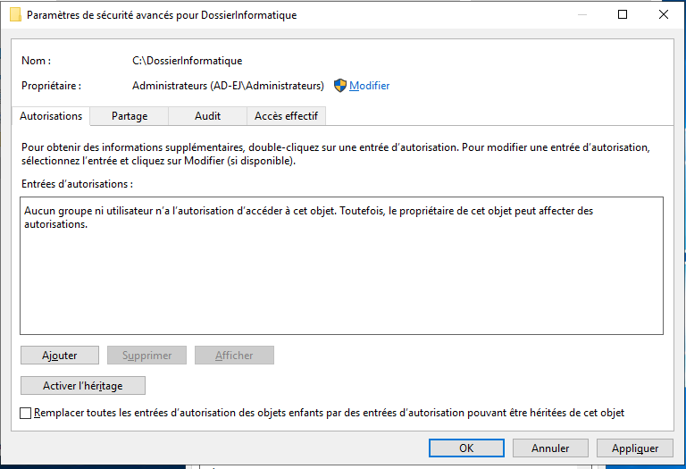
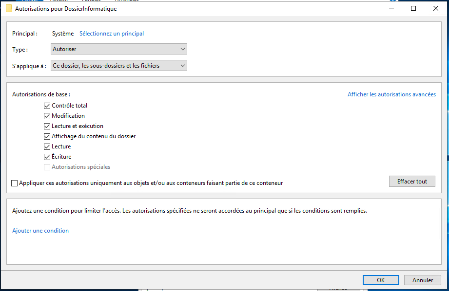
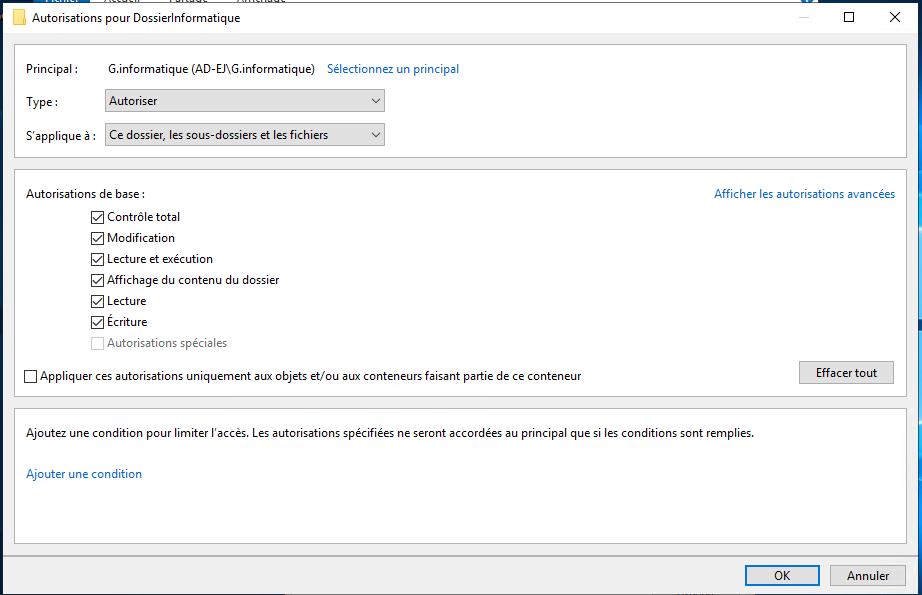

#  Active Directory

Active Directory (AD) est un service de gestion des identités et des accès développé par Microsoft. Il est principalement utilisé dans les environnements Windows pour centraliser et gérer de manière sécurisée les informations relatives aux utilisateurs, aux ordinateurs et aux ressources réseau d'une organisation.

Voici les principales caractéristiques et fonctionnalités d'Active Directory :

1. Annuaire d'entreprise : Active Directory fonctionne comme un annuaire centralisé qui stocke des informations sur les utilisateurs, les groupes, les ordinateurs et autres objets. Il permet de gérer et d'organiser ces objets de manière hiérarchique à l'aide d'unités d'organisation (OU).

2. Authentification et autorisation : Active Directory fournit un mécanisme d'authentification sécurisé pour les utilisateurs et les ordinateurs qui se connectent à un réseau. Il permet également de définir des autorisations d'accès aux ressources en fonction des utilisateurs, des groupes et des stratégies de sécurité définies.

3. Single Sign-On (SSO) : Active Directory prend en charge le Single Sign-On, ce qui signifie qu'une fois qu'un utilisateur s'est authentifié sur son poste de travail, il peut accéder à d'autres ressources du réseau sans avoir à se reconnecter à chaque fois.

4. Gestion des stratégies de groupe : Active Directory intègre la gestion des stratégies de groupe (Group Policy) qui permet de définir des configurations de sécurité, des paramètres de système, des scripts, etc., qui sont appliqués aux utilisateurs et aux ordinateurs.

5. Réplication et redondance : Active Directory utilise la réplication pour maintenir des copies cohérentes des informations dans différents contrôleurs de domaine. Cela assure la disponibilité des données et la redondance pour une meilleure tolérance aux pannes.

6. Services d'annuaire pour les applications : Active Directory offre des services d'annuaire pour les applications, permettant aux développeurs de stocker et de rechercher des informations spécifiques à leurs applications dans l'annuaire.

7. Active Directory est largement utilisé dans les entreprises et les organisations pour gérer de manière centralisée les identités et les accès, faciliter l'administration des ressources et renforcer la sécurité du réseau. Il offre une plateforme solide pour la gestion des utilisateurs, des groupes, des stratégies et des ressources, facilitant ainsi la gestion des environnements Windows et des services associés.


## Installation du Windows server 2019 :


Nous pouvons l'interface du gestionnaire de serveur :


Nous devons renommer le nom du serveur :


Nous configurons le serveur avec un adresse ip statique et nous le mettons lui m^me comme serveur DNS primaire :


## Création de l'annuaire et des objets Active Directory


Nous devons installer le rôle AD DS.

Ce rôle permet de gérer au sein d’un annuaire les utilisateurs, les ordinateurs, les groupes, etc. afin de proposer l’ouverture de session via des mécanismes d’authentification et le contrôle d’accès aux ressources. Enfin, je ne vous apprends rien, car depuis le début de ce cours on parle précisément de ce rôle, mais maintenant vous savez qu’il correspond au rôle « ADDS » défini dans Windows Server.

Depuis le gestionnaire de serveur nous cliquons sur Gérer puis Ajouter des rôles et fonctionnalités :


Nous choissisons le service AD DS :



Après cela nous cliquons sur suivant sauf si nous voulons ajouter des fonctionnalités supplémentaires.


Le rôle a bien été ajouté :


Nous pouvons voir que nous avons un drapeau avec une icône :



Nous cliquons dessus puis sur promouvoir ce serveur en contrôlleur de domaine.


Nous créeons notre nouvelle fôret AD-ej.local :


Nous configurons notre serveur comme contrôleur de domaine.

L'option DNS et obligatoire :


Non car il y a pas encore de serveur DNS :


La configuration qui a été faîtes peut être faîtes avec le script ci-dessous :

```powershell
#
# Script Windows PowerShell pour le déploiement d’AD DS
#

Import-Module ADDSDeployment
Install-ADDSForest `
-CreateDnsDelegation:$false `
-DatabasePath "C:\Windows\NTDS" `
-DomainMode "WinThreshold" `
-DomainName "Ad-ej.local" `
-DomainNetbiosName "AD-EJ" `
-ForestMode "WinThreshold" `
-InstallDns:$true `
-LogPath "C:\Windows\NTDS" `
-NoRebootOnCompletion:$false `
-SysvolPath "C:\Windows\SYSVOL" `
-Force:$true

```

Nous pouvons installer :


Reconnectons nous en tant qu'utilisateur de Adminstrateur du domaine :


Nous pouvons voir, que les services sont bien présent :


Vérifions que le DNS soit bien fonctionnel :


Dans un domaine nous pouvons ajouter des objets venant des classes suivantes :

Ordinateur, Contact, Groupe, UO, imprimante et utilisateur.

Pour faire cela allons sur l'application suivante :


Dans Active Directory Domain Services (AD DS), une unité d’organisation (OU) est un conteneur dans lequel vous pouvez placer des utilisateurs, des groupes, des ordinateurs et d’autres OU. Les OUs sont utilisées pour organiser les objets dans une structure hiérarchique et pour appliquer des stratégies de groupe à plusieurs objets en même temps. Les groupes sont utilisés pour regrouper des objets similaires tels que des utilisateurs ou des ordinateurs et pour leur accorder des autorisations spécifiques. Les groupes peuvent être utilisés pour appliquer des stratégies de groupe à plusieurs objets en même temps.

Créeons une UO informatique :


Créeons un utilisateur :


Maintenant un groupe d'utilisateur informatique l'étendue est local car ce groupe sera en relation qu 'avec les groupes de son domaine :


j'ajoute l'utilisateur Enstso à ce groupe :


Connectons nous  au client :


Nous lui mettons l'adresse du serveur AD comme dns primaire :


Mettons le client dans notre domaine en passant par Renommer ce PC (avancé) :


Reconnectons nous en l'utilisateur Enstso :


## Stratégie de groupe :

Une stratégie de groupe est utiliser pour  :

1. Définir les objectifs : Tout d'abord, identifiez les objectifs de votre stratégie de groupe Active Directory. S'agit-il de définir des paramètres de sécurité, de configurer des préférences utilisateur, de gérer les logiciels installés ou d'appliquer des restrictions spécifiques ? Avoir des objectifs clairs vous permettra de définir les mesures appropriées.

2. Organiser les unités d'organisation (OU) : Utilisez les unités d'organisation pour organiser vos utilisateurs, ordinateurs et groupes dans une structure logique. Cette organisation vous permettra d'appliquer des stratégies de groupe de manière plus ciblée et de manière cohérente en fonction des besoins spécifiques des différents groupes.

3. Créer des stratégies de groupe : Utilisez l'éditeur de gestion des stratégies de groupe pour créer et configurer les stratégies de groupe correspondant à vos objectifs. Vous pouvez définir des paramètres de sécurité, des paramètres de configuration du système, des scripts de connexion, des paramètres de stratégie de mot de passe, etc.

4. Lier les stratégies de groupe : Liez les stratégies de groupe aux unités d'organisation appropriées. Cela permettra d'appliquer les stratégies de groupe aux utilisateurs, ordinateurs et groupes inclus dans ces unités d'organisation.

5. Tester et déployer : Avant de déployer les stratégies de groupe à grande échelle, effectuez des tests sur un groupe restreint d'utilisateurs ou d'ordinateurs. Vérifiez que les stratégies fonctionnent comme prévu et ne causent pas de problèmes inattendus. Une fois les tests réussis, déployez les stratégies de groupe sur l'ensemble de votre infrastructure Active Directory.

6. Surveiller et mettre à jour : Surveillez régulièrement l'efficacité des stratégies de groupe et effectuez les mises à jour nécessaires. Réévaluez également vos objectifs et ajustez vos stratégies de groupe en fonction des changements organisationnels ou des nouveaux besoins.


Mettons en place une stratégie permettant aux utilisateurs de se connecter en bureau à distance sur les pc :


Clique droit modifier :


Configuration ordinateur > Stratégies > Modèles d'administration > Composants Windows > Services bureau à distance > Hôte de la session Bureau à distance > Connexions

Activé :


Pour mettre à jour il est nécessaire de taper cette commande :

```powershell
gupdate/force
```
Nous pouvous maintenant nous connecter :


## Dossier partagé

Créeons un dossier :

J'autorise le groupe G.informatique et l'administrateur à avoir accès au dossier :


Au niveau de la sécurité des dossiers et des sous-dossiers :









Pour cela il est nécessaire de mettre en place une stratégie de groupe :


Pour mettre à jour il est nécessaire de taper cette commande :


Nous pouvons voir que dossier de l'utilisateur Administrateur a bien été crée :


Pour l'utilisateur Enstso :


