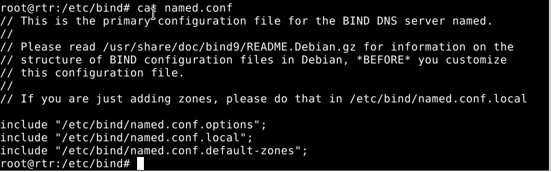

# Serveur Dns Linux

1 . Mise en place :
## Objectifs :Gérer un domaine et ses enregistrements. Comprendre le fonctionnement des outils de tests DNS.

Pour le serveur Dns Linux il est nécessaire d'installer les paquets bind 9 & bind 9doc.

Pour la configuration des requêtes Dns sur un serveur Dns dans le fichier   /etc/resolv.conf de mon serveur :

Pour les clients :

2. <u>Configuration de base pour votre zone Dns</u> :

Les fichiers de configuration DNS sont situés dans le répertoire /etc/bind. Le fichier de configuration de base est /etc/bind/named.conf.

La ligne include spécifie le nom du fichier contenant les options DNS.

/etc/bind/named.conf.options indique au DNS où chercher les fichiers. Tous les fichiers utilisés par BIND seront relatifs à ce répertoire.

### configuration de ma zone personelle :

* option type master, pour inscrire une nouvelle zone principale 

* option file, pour indiquer l’emplacement du fichier de zone correspondant à mon domaine DNS. . Par défaut dans /var/cache/bind

mazone.local

Dans mon fichier de configuration de base named.conf.local :

Dans mon fichier de zone db.mazone.local :

J'ai ajouter des enregistrements de type A pour mes différents clients et mon serveur(rtr).

exemple le client 1 = clt1 à pour adresse ipv4 192.168.186.10

Après cela je redémmare le service bind9 avec la commande systemctl restart bind9