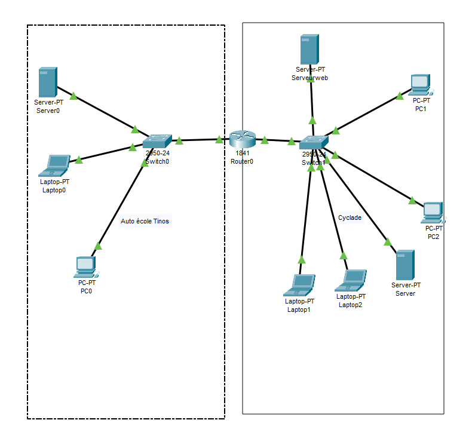
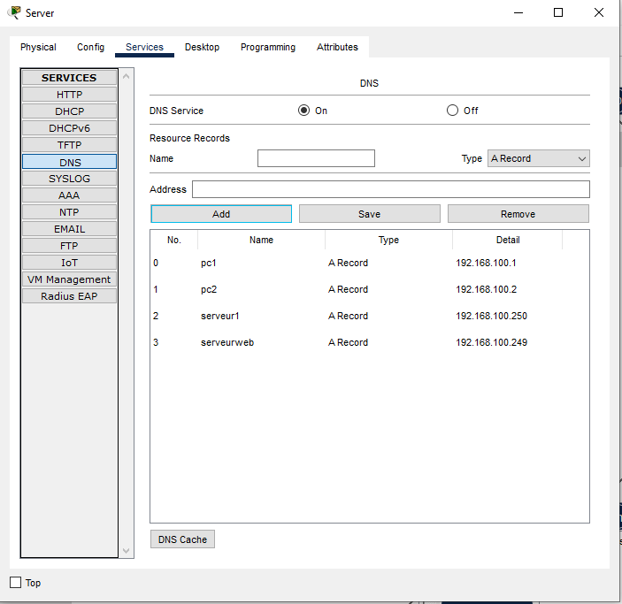
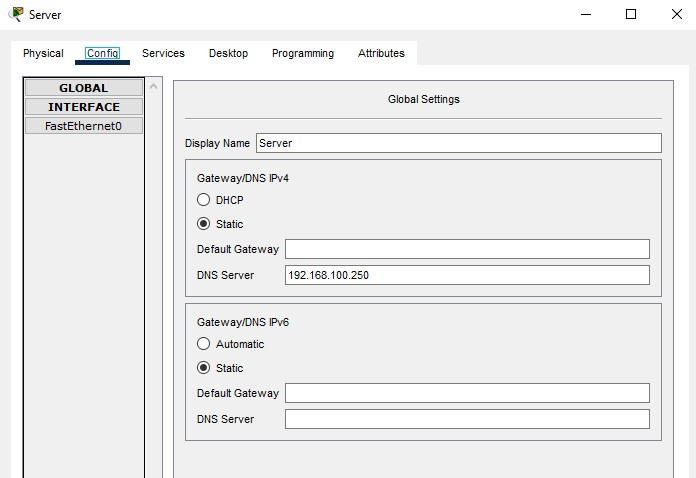

# La résolution de noms : service DNS

## Résolution de noms 

Il existe un fichier host sur toutes les machines dans lequel figure le nom de machine en face d'une adresse IP. Linux(etc/hosts) et Windows(c:\Windows\System32\drivers\etc\hosts).

Les principaux serveurs de noms sont le serveur Dns et le serveur Wins, le serveur wins fait le lien entre les noms NetBios et les IP, il est plus souvent présent sur des petits réseau local, alors que le Dns est un systeme de resolution faisant parti des protocoles du TCP\IP donc c'est celui qui utilisé sur internet.

Le Dns fait le lien entre le nom d'une machine est une @IP.

## Domaines de noms

Le système Dns identifie une machine par un ou plusieurs noms suivi du nom de son réseau

ex :

pc.network

pc = nom de machine
network = le reseau

ce nom est un FQDN qui est le nom complet d'une machine permetant d'identifier une machine, elles sont unique sur internet.

Pour qu'un FQDN soit reconnu sur internet il faut qu'il soit enregistré chez des organismes comme l'afnic ou L'ICANN.

Ces organismes gérent une base de données mondiale
mais des règles sont à respecter pour faire un dépot de dns :

FQDN <= 255 caratères / maj et min non significatives et pas de signification imposée pour les labels.

le premier niveau de l'espace Dns est le TLD(Top level domain)
exemple : com/net/org etc...

Pour la résolution d'une adresse ip en un nom, le client envoi une requête vers un serveur Dns si le serveur reconnait le nom il envoi une réponse(ip) au client dans le cas contraire il transmet la requête à son serveur superieur hiérarchique. Dans ce système il existe des domaines dits racines et domaines principaux.

## Serveurs de noms

Un domaine est défini grâce à son serveur primaire. Ce serveur est créer dès qu'une responsabilité administratives lui a été déléguée pour le domaine concerné. Le serveur est le seul responsable des modifcations qu'il peut y avoir sur le domaine.

Si dans le domaine il existe d'autres serveurs ils sont considérés comme des serveurs secondaire, il ne possède qu'une copie du domaine du primaire.

Un serveur Dns peut être le primaaire d'une ou plusieurs zones(domaines) de même pour secondaire mais il en peut être le primaire et secondaire d'une même zone.

Dans une zone DNS on retrouve des informations d'un domaine comme celles de ses zones déléguées(sous domaines) qui sont gérées par les serveurs désignés responsables. Il est possible d'ajouter des informations à une zone pour faciliter la résolution de noms.

Résumé :

Serveur primaire :
* enregistre les données propres à une partie de l'espace nom de domaine dans une zone.

* a une autorité administratives sur cette zone.

* maintient la bdd de la zone.

Serveur secondaire :

* Obtient les données de la zone via un autre serveur de nom qui a également l'autorité administrative.
* Intérroge périodiquement le serveur de nom primaire et met à jour les données.

Une zone ne contient que des dpnnées utiles à la résolution de noms des domaines concerné.

L'utilisation de serveur secondaire permet de mieux répartir la charge des requêtes donc il sera plus facile de gérer une panne de serveur.

## Enregistrements

Le serveur Dns est annuaire de correspondance entre des FQDN et des IP mais aussi entre des machines et des services.
Le tout est stocké sous forme d'enregistrement dans des fichiers au nom du domaine, exemple: db.google.fr ou siogreta.dns (formalise répandus mais ne sont pas obligatoire !).

Les principaux enregistrements:

* A : Les enregistrements de ressources A (pour @ d'hôte) sont de smappage entre un nom de machine et une @ ipv4. Ils représentent la majorités des enregistrements de ressources.

* AAAA : Enregistrement de ressoures entre le nom d'une machine est une @ ipv6.

* CNAME : les enregistrements de ressources de type CNAME(nom canonique) sont des mappages entre un nom d'hôte et un autre nom d'hôte. Ils permmetent de créer des alias pour un nom de machine donné  (c'est à dire d'associer plusieurs noms d'hôte à une même machine). Exemple: créer une machine ww pour serveur Web.

* HINFO : Les enregistrement de ressources type (Host info) spécifient le type de processeur et l'OS correspondant à un hôte.

</b>

## Pratique packet Tracer :

Le serveur du bâtiment Cyclade est le serveur dns dans lequel j'ai lié Les noms des hotes à leur @Ip.

Configs de mes machines :

test de communication du pc1 vers le pc2 par nom de domaine :

J'ai configuré mon serveur web en lui spécifiant @ip de mon serveur DNS.

 

Sur mon serveur web j'héberge un site web :

Depuis le PC1 je tape le Dns de mon site web :

