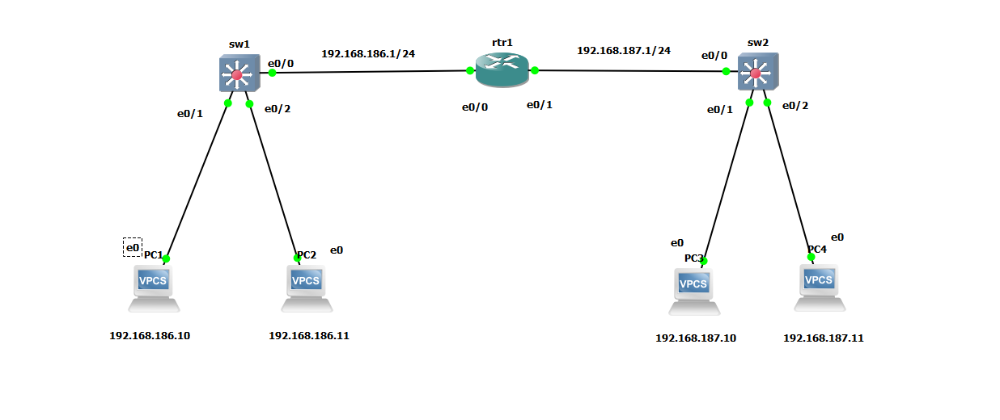
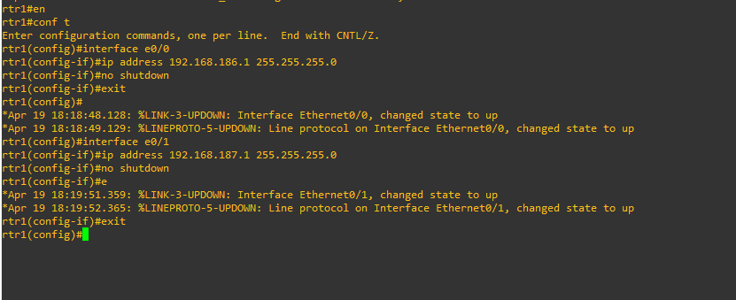
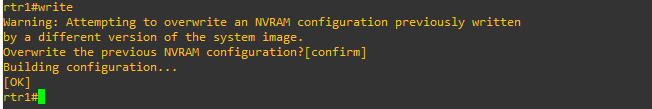
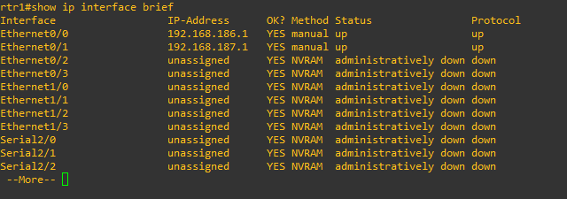
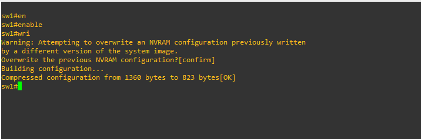
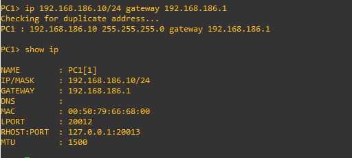
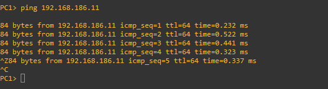
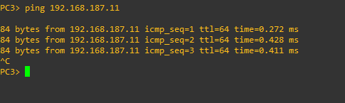
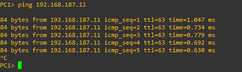

# Lab01

Les équipements réseau de ce lab :

- un routeur
- 2 switchs de couche 3

Pour compléter cela j'ajoute 4 clients, 2 pour chaque switchs.

 

Configuration du routeur 1 :

 

je tape write pour enregistrer ma configuration :

 

Vérifions la configuration :

 

Configuration du switch 1 :

 

Pour mon client je lui spécifie sa passerelle 192.168.186.1.

Configuration du client 1 :

 

Test

ping client 1 vers client 2 :

 

ping client 3  vers client 4 :

 

ping client 1 vers client 4 :

 

Le routage est géré par défaut c'est la raison pour laquelle les deux réseaux arrivent à communiquer.