# Lab02 (Vlans)

Vlan : Un VLAN (Virtual Local Area Network) est un réseau local virtuel qui permet de regrouper des périphériques réseau en fonction de critères tels que la fonction, le service, le département ou l'emplacement géographique, indépendamment de leur emplacement physique dans le réseau.

En d'autres termes, il s'agit d'une méthode de segmentation logique d'un réseau physique en plusieurs sous-réseaux distincts, qui peuvent communiquer entre eux selon les besoins. Les VLAN sont souvent utilisés pour améliorer la sécurité et la gestion de réseau, ainsi que pour optimiser les performances en réduisant la taille des domaines de diffusion.

Les équipements réseau de ce lab :

- un routeur
- 3 switchs de couche 3

L'objectif est de mettre en place 3 vlans :

- vlan 10 : data
- vlan 20 : juridique
- vlan 30 : Rh

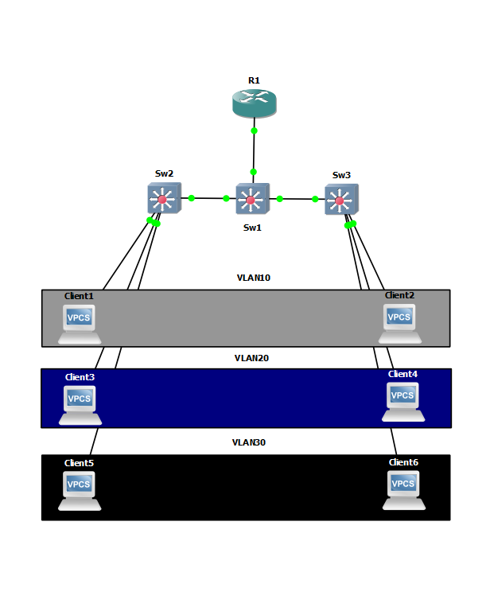 

Nous retrouvons 2 clients par vlan reliés à des switchs différents.

Méthode configuration switch :

- Créer le vlan
- le nommer
- définir les ports du vlan 10 crée
- configurer les ports avec le mode access
- configurer le mode trunk sur le/les ports reliés à d'autres switchs

## Switchs

création des vlans sur le switch 2 :

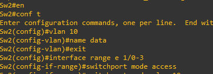 

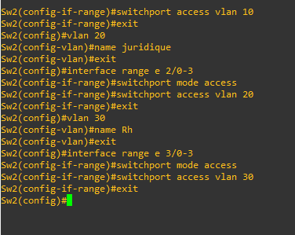 

création du lien tagué (trunk) :

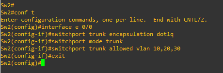 

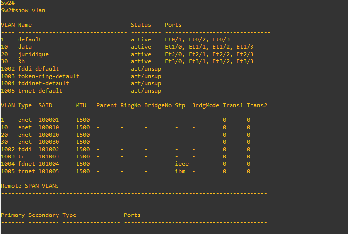 

## Routeur

L'encapsulation dot1q est une méthode de marquage des trames Ethernet pour permettre la transmission de plusieurs VLAN (Virtual Local Area Networks) sur un même lien physique. Elle ajoute un en-tête de 4 octets à la trame Ethernet existante, ce qui permet d'identifier le VLAN auquel appartient la trame.

Méthode configuration routeur :

- choisir des sous-interfaces
- définir l'encapsulation dot1q 
- definir des adresses ip statique qui serviront de passerelle pour nos clients

Sur notre routeur affichons les interfaces du routeur ;

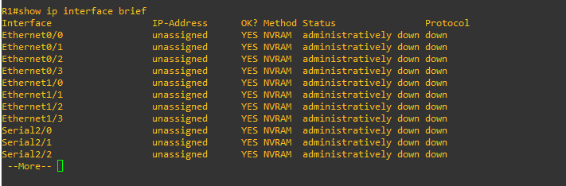 

Création des sous-interfaces :

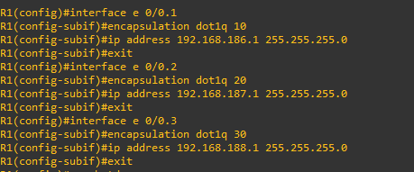 

J'active les interfaces du routeur avec la commande no shutdown :

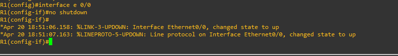 

configuration du client 1 :

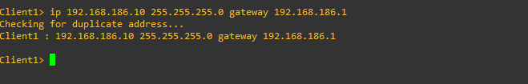 

Test :

Ping client 5 vers client 6 (vlan 30) :

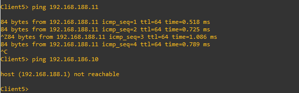 

Nous pouvons voir que le client 1 n'est pas accessible car il vient du vlan 10.

## VTP

VTP signifie "VLAN Trunking Protocol". C'est un protocole de communication utilisé dans les réseaux informatiques pour faciliter la gestion des réseaux VLAN (Virtual LAN).

VTP permet aux commutateurs de communiquer les informations de configuration des VLANs entre eux de manière automatique et cohérente, sans que les administrateurs réseau aient à configurer manuellement chaque commutateur.

Pour le mettre en place nous ajouterons un switch supplémentaire, de plus nous mettrons un switch en mode transparent.

- sw1 : mode server
- sw2 : mode transparent
- sw3 : mode client
- sw4 : mode client

Sur notre switch nous pouvons que le mode serveur est activé :

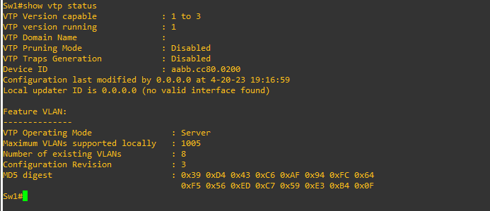

Nous créeons notre domaine de vlans :

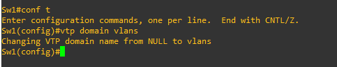

Nous ajoutons un nouveau switch (sw4) :

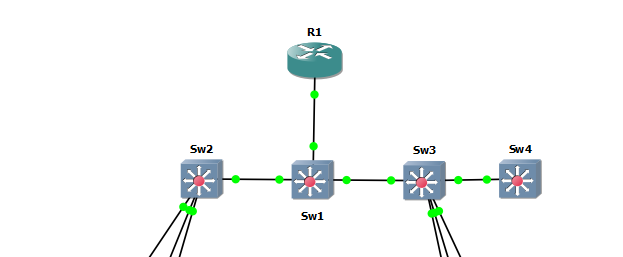

Par défaut il est en mode serveur :

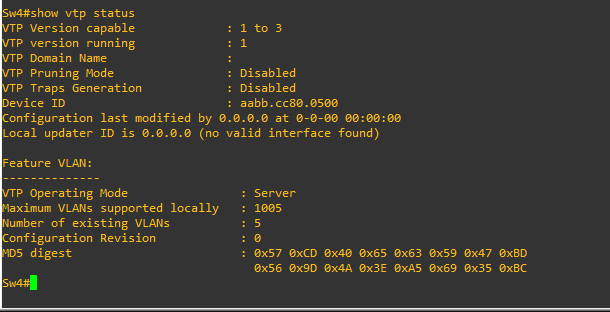

Nous le mettons en mode client :

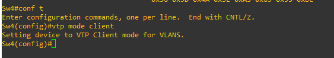

Le switch 3 est relié au switch 4 il est nécessaire de configurer le mode trunk :

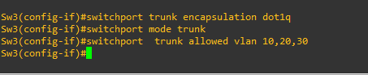

Créeons le vlan 40 imprimante sur notre switch 1 qui a le mode server : 

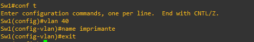

Sur les switchs 3 et 4  nous pouvons voir que le vlan 40 est bien présent :

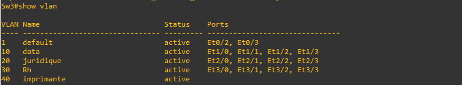

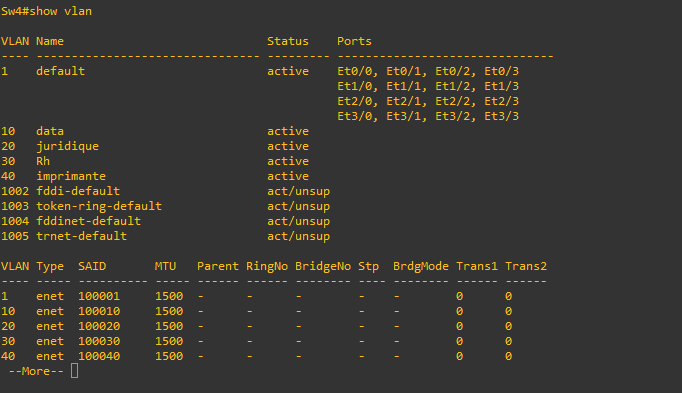

Essayons de créer un vlan sur notre switch 4 :

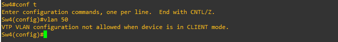

Cela ne marche car il possède le mode client.

Nous configurons notre switch 2 en mode transparent :

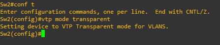

Nous créeons un nouveau vlan 50 (dev) :

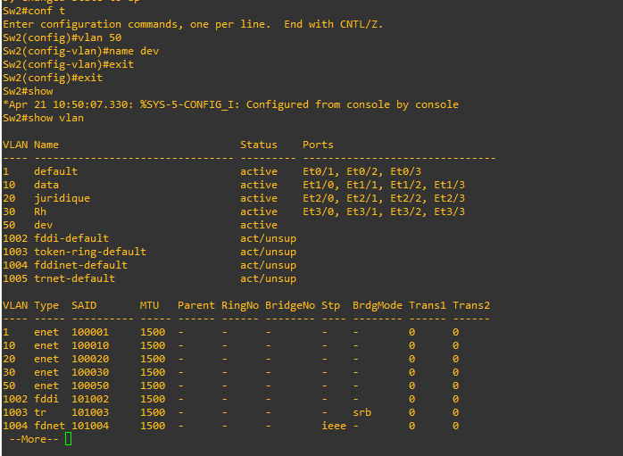

Le vlan a bien été enregistré.

