# Lab03 (NAT)

Le NAT est l'abréviation de "Network Address Translation" (traduction d'adresse réseau en français). Il s'agit d'une technique utilisée pour permettre à plusieurs ordinateurs d'une même réseau local (par exemple, une entreprise) de partager une adresse IP publique unique pour accéder à Internet ou un autre réseau possédant les même adresses ip.

Les équipements réseau de ce lab :

- un routeur
- 1 switch de couche 3

L'objectif est de mettre en place du nat :

- nat statique
- pat

Lab :

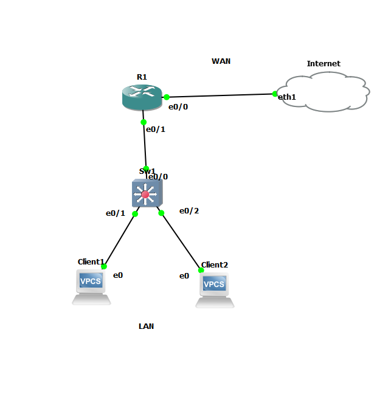

Je configure l'accès à mon wan (réseau lan de maison) en choissisant ma carte réseau mais pour mon cas j'ai choisi mon commutateur virtuel :

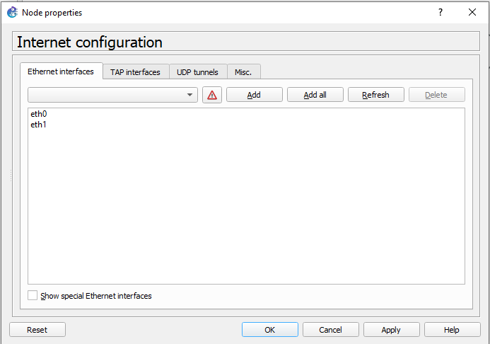 

## Clients

Configuration de l'interface du client 1 :

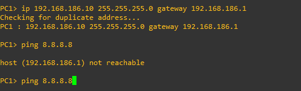 

Configuration de l'interface du client 2 :

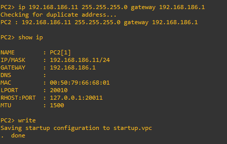

## Routeur

### NAT statique 

Je configure mon interface lan 192.168.186.1 et coté wan je le mets en mode dhcp :

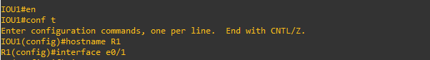 

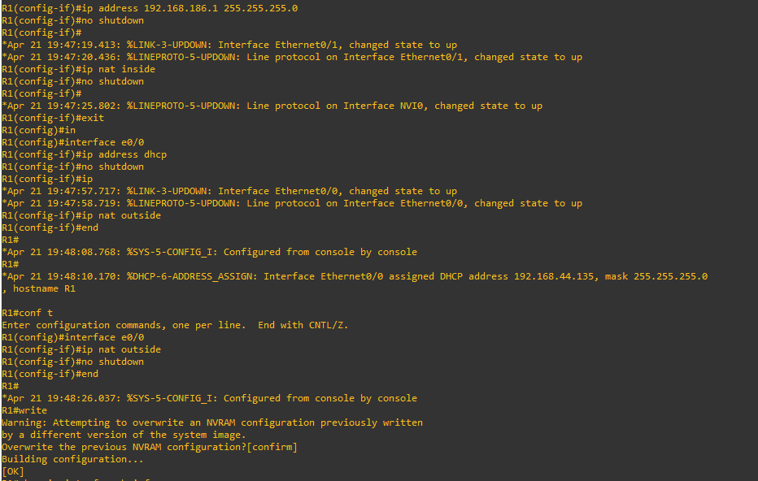 

Je spécifie que l'adresse ip 192.168.186.10 deviendra 192.168.44.135 en sortie du lan :

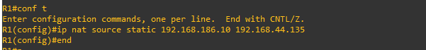 

Nos interfaces :

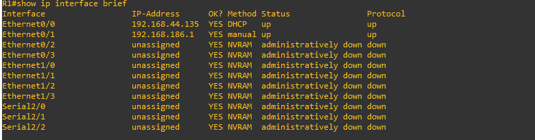 

Depuis le client 1, je ping google pour voir si je communique avec l'extérieur :

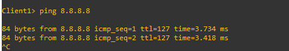 

Cela est un succès.

Inside local address : L'adresse de la machine sur le réseau lan.

Inside Global address : L'adresse traduite à l'intérieur du lan.

| Inside local     | Inside Global   | 
| :--------------- |:---------------:| 
| 192.168.186.10   |   192.168.44.135|

### PAT

Configuration pour le pat :

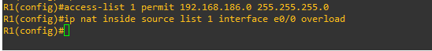

test client 1 vers google :

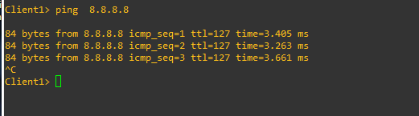

test client 2 vers google :

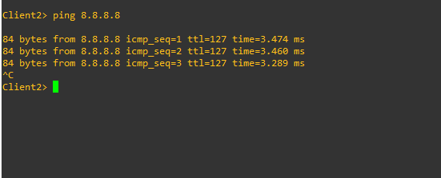

| Inside local     | Inside Global   | 
| :--------------- |:---------------:| 
| 192.168.186.10:1024   |   192.168.44.135:1024|
| 192.168.186.11:1025   |   192.168.44.135:1025|  

