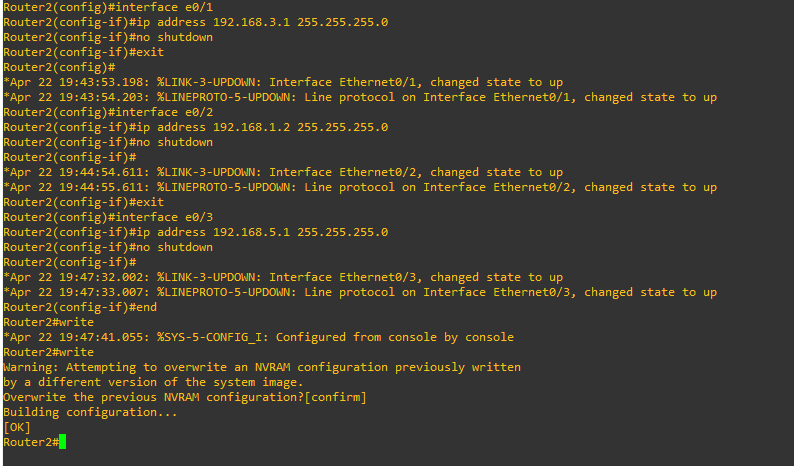

# Lab04 Routage dynamique (EIGRP & OSPF)

## OSPF
 
 OSPF (Open Shortest Path First) est un protocole de routage qui permet aux routeurs d'échanger des informations sur la topologie du réseau et de calculer les meilleurs chemins pour acheminer les paquets entre les différents réseaux connectés. OSPF est un protocole à état de lien, ce qui signifie qu'il utilise des informations sur l'état des liens entre les routeurs pour prendre des décisions de routage. OSPF est largement utilisé dans les réseaux d'entreprise car il est efficace pour gérer des réseaux de grande taille avec des chemins de redondance et des liens de haute capacité. Il est également pris en charge par de nombreux équipements de réseau et est considéré comme un protocole de routage standard de l'industrie.

 ## EIGRP 

 EIGRP (Enhanced Interior Gateway Routing Protocol) est un protocole de routage à vecteur de distance propriétaire développé par Cisco Systems. EIGRP a été conçu pour améliorer et remplacer le protocole de routage à vecteur de distance (RIPv1 et RIPv2) en offrant une convergence rapide, une utilisation efficace de la bande passante du réseau, une prise en charge de la redondance et une grande évolutivité. EIGRP utilise une approche hybride de routage à la fois à vecteur de distance et à état de lien, ce qui le rend plus efficace et plus rapide que les protocoles de routage à vecteur de distance traditionnels. EIGRP est couramment utilisé dans les réseaux d'entreprise et les réseaux de fournisseurs de services.

Ces 2 protocoles de routage sont des protocoles de type IGP (Interior Gateway Protocol).

Les équipements réseau de ce lab :

- 4 routeurs
- 5 switchs de couche 3

Lab :

Les objectifs sont de mettre en place 2 protocoles de routage dynamique + NAT (pour internet).

## Adressages :

### Sous-réseau 1 10.20.0.0/22
----------------------------------------------------------------

Pc1 : 10.20.0.1
Router1 : 10.20.0.254

### Sous réseau 2 10.30.0.0/22
----------------------------------------------------------------

Pc2 : 10.30.0.1

Webterm-1 10.30.0.2

Router2 : 10.30.0.254

### Sous-réseau 3 10.40.0.0/22
----------------------------------------------------------------

Pc3 : 10.40.0.1

Router3 : 10.40.0.254

### Sous-réseau 4 10.50.0.0/22
----------------------------------------------------------------

Pc4 : 10.50.0.1

Router4 : 10.50.0.254

### Sous-réseau A 192.168.0.0/24
----------------------------------------------------------------

Router1 : 192.168.0.1

Router3 : 192.168.0.2

### Sous-réseau B 192.168.1.0/24
----------------------------------------------------------------

Router1 : 192.168.1.1

Router2 : 192.168.1.2

### Sous-réseau C 192.168.2.0/24
----------------------------------------------------------------

Router3 : 192.168.2.1

Router4 : 192.168.2.2

### Sous-réseau D 192.168.3.0/24
----------------------------------------------------------------

Router3 : 192.168.3.1

Router4 : 192.168.3.2

### Sous-réseau E 192.168.4.0/24
----------------------------------------------------------------

Router1 : 192.168.4.1

Router4 : 192.168.4.2

### Sous-réseau F 192.168.5.0/24
----------------------------------------------------------------

Router2 : 192.168.5.1

Router3 : 192.168.5.2

### Wan 192.168.122.0/24 
----------------------------------------------------------------

Router2 : 192.168.122.82

Pc5 : 192.168.122.209

Webterm-2 : 192.168.122.208

NAT1 (Internet)

## Préconfiguration
Premièrement nous configurons les interfaces des routeurs :

Après avoir fais cela nous configurons le pc1 du sous-réseau 1 :

Webterm est basée sur Debian. Il contient le navigateur web firefox plus les utilitaires suivants : net-tools, iproute2, ping, traceroute, curl, host, iperf3, mtr, socat, ssh client, tcpdump, ab(apache benchmark) et les outils de test multicast.

Le container docker webterm-1  du sous-réseau 2 :

Nous pouvons voir,  qu'il arrive à communiquer avec sa passerelle. De plus en nameserver dans le fichier /etc/resolv.conf  nous avons spécifié le serveur Dns publique de Google.

L'interface e1/0 est celle coté Wan du réseau 192.168.122.0, il est donc possible d'obtenir une adresse ip via le Dhcp :

Après avoir configuré notre routeur 2, nous tentons de communiquer avec le serveur de google :

Cela est un succès.

Pour la configuration de notre container 192.168.122.208 du Wan, nous le mettons en Dhcp :

Test sur un navigateur, nous avons internet :

Configuration du pc5 du Wan en Dhcp :

## Routage dynamique

Premièrement sur le routeur 1, nous configurons les réseaux qui utiliseront le protocole Eigrp :

0.0.0.255 est le masque inversé :

255.255.255.255 - 255.255.255.0  

Pour notre routeur 3 le réseau 192.168.5.0 utilisera le protocole ospf :

Nos réseaux utilisants le protocole eigrp sur notre routeur 2 :

Comme pour le routeur 3, nous configurons notre interface du réseau 192.168.5.0 avec le protocole ospf sur le routeur 2 :

Configuration du routeur 4 :

Nous pouvons voir qu'il détecte le protocole eigrp des autres routeurs.

Visualisons les routes :

Rappelons que la métrique de l'eigrp aura toujours une meilleure métrique que ospf car ospf est propriétaire Cisco.

Sur le pc4 du réseau 10.50.0.0, Nous communiquons avec tous les interfaces du routeur 4 :

Sur notre routeur 2, pour vérifier que protocole Ospf a bien été mit en place, nous tapons la commande suivante :

Nous pouvons voir qu'il a bien été mit en place.

Pour que notre container webterm du sous-réseau 10.30.0.0 ait internet, nous alllons faire du Pat :

Le pc2 du réseau 10.30.0.0 communique avec le serveur de google :

Regardons la table nat du routeur 2 :

Pour finir, nous pouvons voir que le container webterm du réseau 10.30.0.0 a bien internet :

