# Lab05 Proxy Squid


Proxy : Un proxy (ou serveur mandataire) est un serveur informatique qui sert d'intermédiaire entre un client et un serveur distant. Lorsqu'un utilisateur envoie une demande à travers un proxy, celle-ci est transmise au serveur distant par le proxy au nom de l'utilisateur, et la réponse du serveur distant est renvoyée au client par le proxy.

Les proxies sont souvent utilisés pour des raisons de sécurité, de confidentialité ou de performance. Par exemple, un proxy peut être configuré pour bloquer l'accès à certains sites web ou pour filtrer le contenu de certaines pages, pour masquer l'adresse IP de l'utilisateur et protéger ainsi sa vie privée, ou pour accélérer l'accès à certains contenus en stockant une copie en cache sur le serveur proxy.

Il existe différents types de proxies, tels que les proxies HTTP, les proxies SOCKS, les proxies transparents et les proxies inversés, chacun ayant ses propres caractéristiques et utilisations.


## Paramétrages Lab


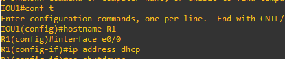

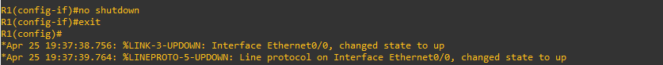

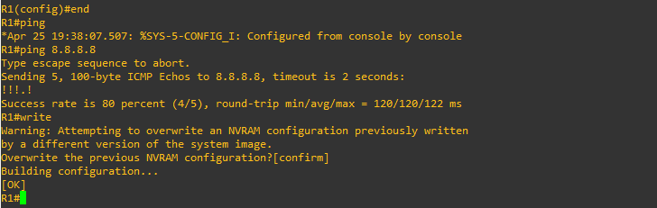

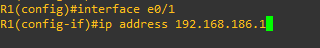

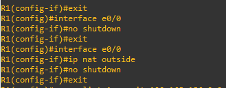

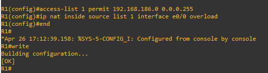

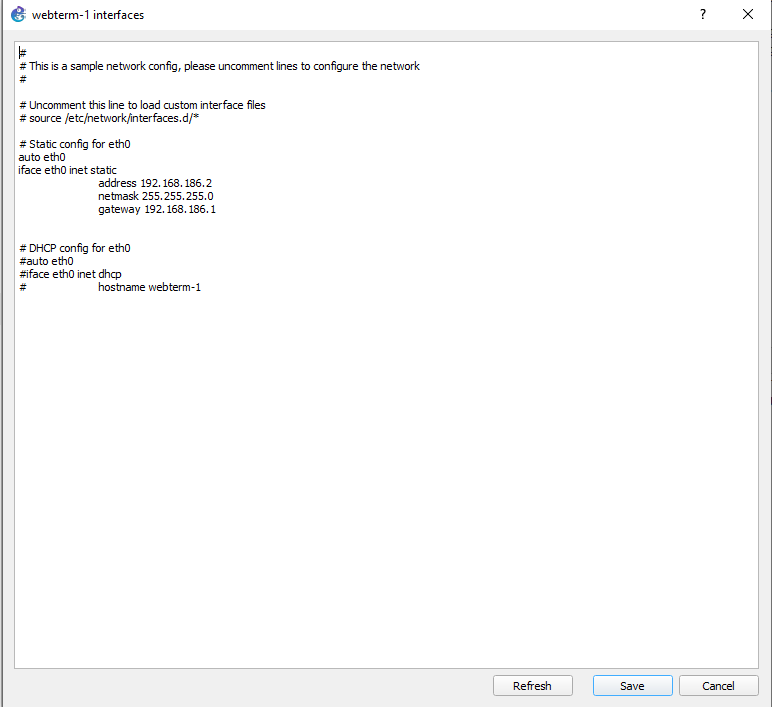

## Configuration proxy


Pour cela il sera nécessaire d'installer les paquets suivants sur la vm :

- squid
- squidguard
- apache2-utils
- lightsquid

Il faudra ensuite créer les répertoires suivants :

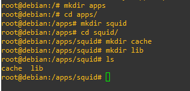

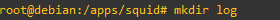

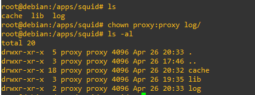


Un utilisateur proxy sera le contrôleur de vos processus squid, il faut donc qu’il ait tous les droits sur les fichiers et répertoires créés ou que nous créeront. Donnez tous les droits à proxy sur les répertoires précédents.

Changement du propriétaire : 

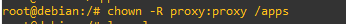


Il faudra ensuite télécharger la blackliste :

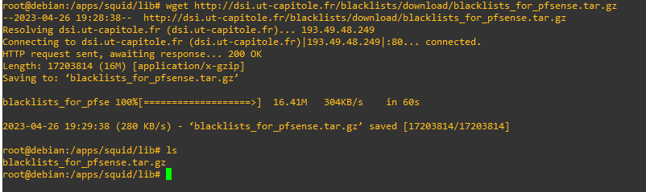

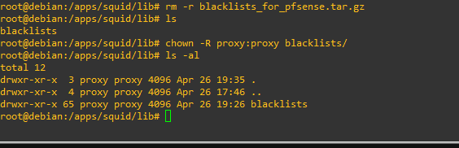

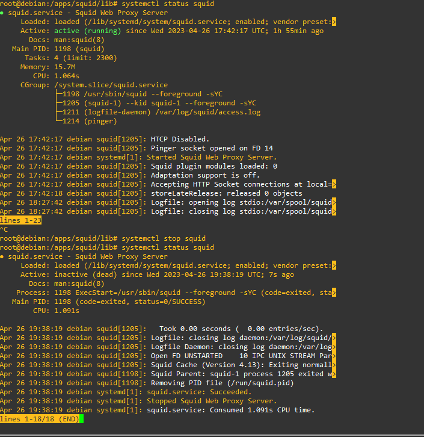

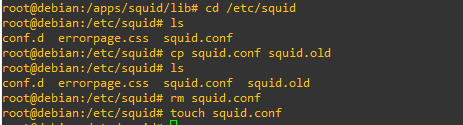


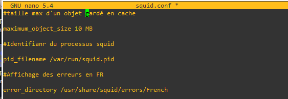

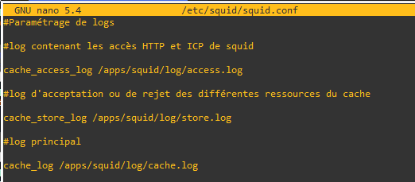

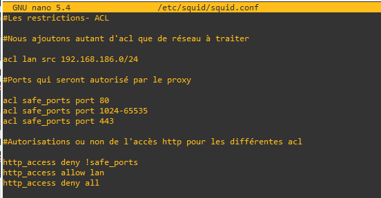

Générons les répertoires et fichiers de cache avec la commande suivante :

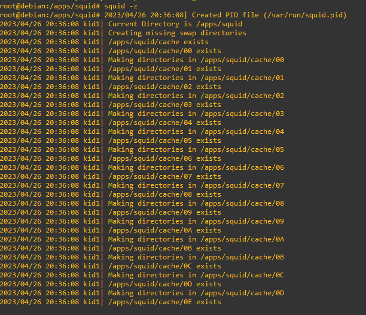

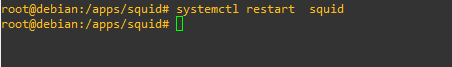

Pour afficher le cache :

```sh
tail –f /apps/squid/log/cache.log 	
```

Pour afficher qui est passé apr le proxy :

```sh
tail –f   /apps/squid/log/access.log
```


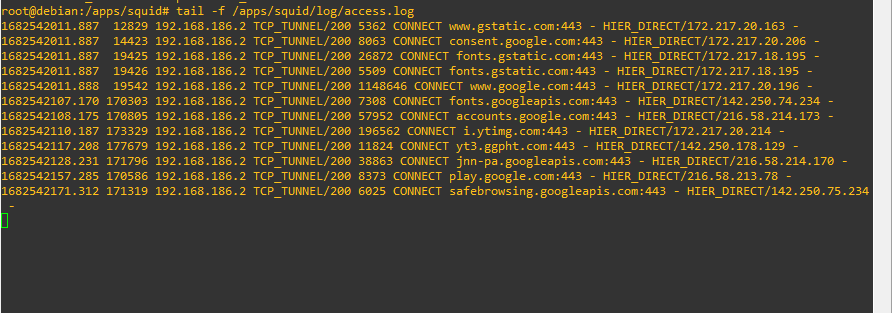

### Configuration squidGuard

Nous allons maintenant améliorer la sécurité de squid en lui ajoutant un logiciel qui va permettre l’interdiction de site Web en fonction de blacklists. Il permet bien d’autres options mais nous nous concentrerons sur celles ci. L’utilisation des blacklists nécessite une observation préalable de l’arborescence existante pour chaque groupe d’interdiction.

Renommons le fichier /etc/squidguard/squidGuard.conf,afin de faire le nôtre :

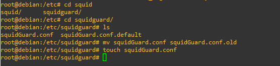


ACL: Un ACL Proxy, ou "Access Control List Proxy" en anglais, est une technique utilisée pour limiter l'accès à un réseau ou à Internet. Cela implique l'utilisation d'un serveur proxy pour filtrer et bloquer les requêtes entrantes ou sortantes en fonction de critères prédéfinis.

L'ACL Proxy utilise une liste de contrôle d'accès pour déterminer si une demande doit être autorisée ou refusée. Cette liste de contrôle d'accès peut être basée sur l'adresse IP de l'utilisateur, le type de demande (par exemple, HTTP ou FTP), le port de destination, le contenu de la demande ou tout autre critère approprié.

L'utilisation d'un ACL Proxy peut aider à renforcer la sécurité du réseau en empêchant les utilisateurs non autorisés d'accéder à des ressources spécifiques, en bloquant les attaques potentielles et en limitant l'exposition du réseau aux menaces externes. Cependant, il est important de noter que l'ACL Proxy n'est pas une mesure de sécurité à elle seule, et doit être utilisé en conjonction avec d'autres techniques de sécurité pour une protection optimale.

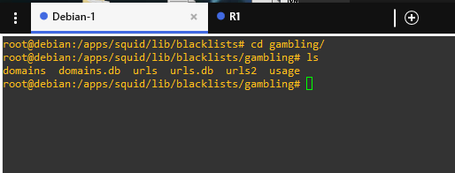

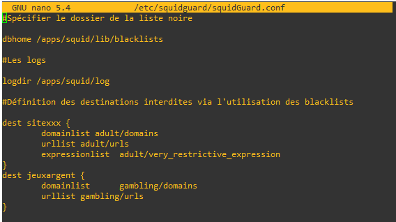

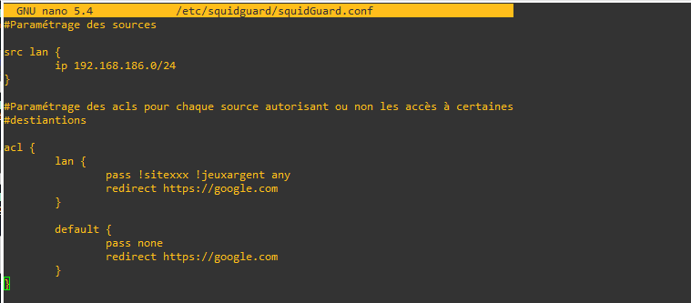

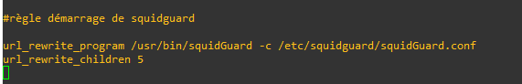

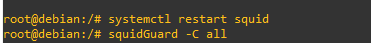

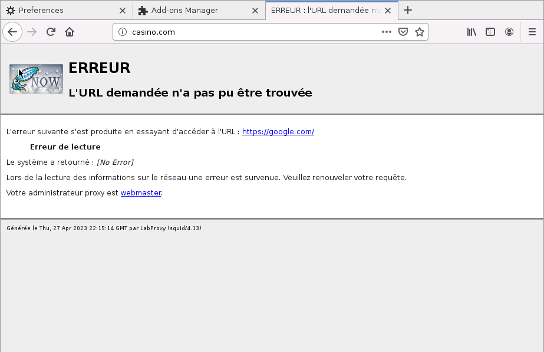

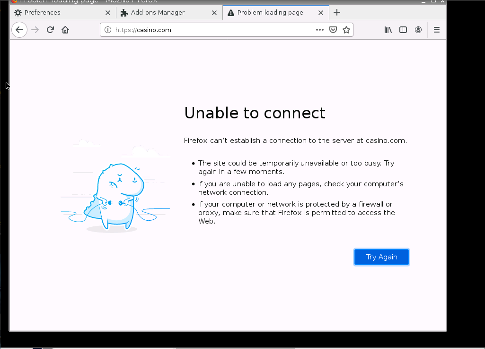

