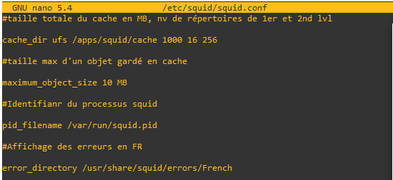
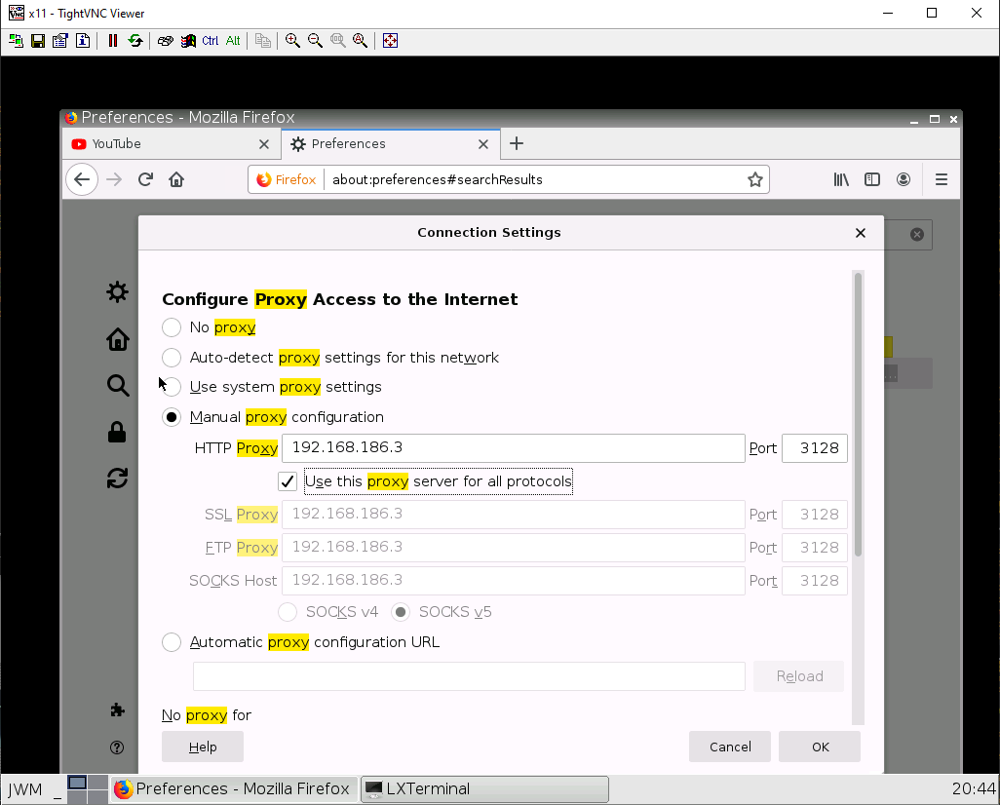

# Lab05 Proxy Squid


Proxy : Un proxy (ou serveur mandataire) est un serveur informatique qui sert d'intermédiaire entre un client et un serveur distant. Lorsqu'un utilisateur envoie une demande à travers un proxy, celle-ci est transmise au serveur distant par le proxy au nom de l'utilisateur, et la réponse du serveur distant est renvoyée au client par le proxy.

Les proxies sont souvent utilisés pour des raisons de sécurité, de confidentialité ou de performance. Par exemple, un proxy peut être configuré pour bloquer l'accès à certains sites web ou pour filtrer le contenu de certaines pages, pour masquer l'adresse IP de l'utilisateur et protéger ainsi sa vie privée, ou pour accélérer l'accès à certains contenus en stockant une copie en cache sur le serveur proxy.

Il existe différents types de proxies, tels que les proxies HTTP, les proxies SOCKS, les proxies transparents et les proxies inversés, chacun ayant ses propres caractéristiques et utilisations.


## Paramétrages Lab


## Configuration proxy


Pour cela il sera nécessaire d'installer les paquets suivants sur la vm :

- squid
- squidguard
- apache2-utils
- lightsquid

Il faudra ensuite créer les répertoires suivants :


Un utilisateur proxy sera le contrôleur de vos processus squid, il faut donc qu’il ait tous les droits sur les fichiers et répertoires créés ou que nous créeront. Donnez tous les droits à proxy sur les répertoires précédents.

Changement du propriétaire : 


Il faudra ensuite télécharger la blackliste :





Générons les répertoires et fichiers de cache avec la commande suivante :


Pour afficher le cache :

```sh
tail –f /apps/squid/log/cache.log 	
```

Pour afficher qui est passé apr le proxy :

```sh
tail –f   /apps/squid/log/access.log
```



