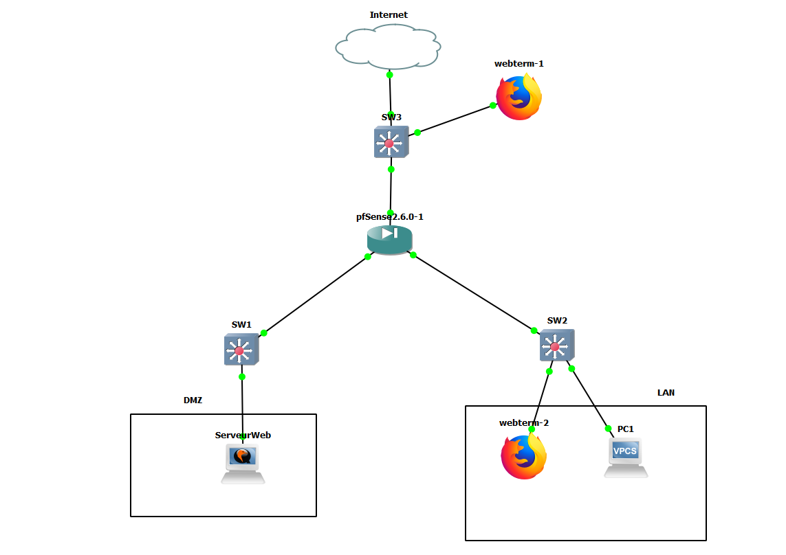
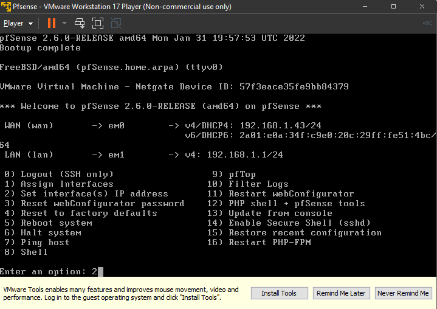
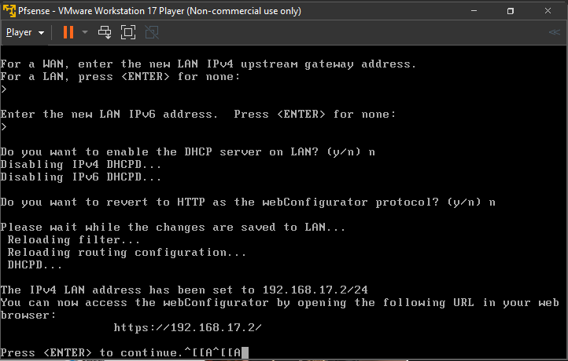

# Routeurs/Pare-feu Pfsense

Après avoir installé et redémarré le pare-feu pfsense sur Vmware : 

je choisis l'index 2 pour configurer mes interfaces :

Différentes questions nous sont posées :

Le nombres d'interfaces que je souhaites configurer :
2

Entrer la nouvelle adresse ipv4 :
192.168.17.2

Le masque de sous-réseau qu'on souhaite :
24

