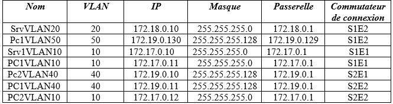
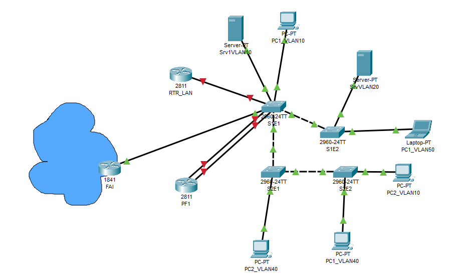
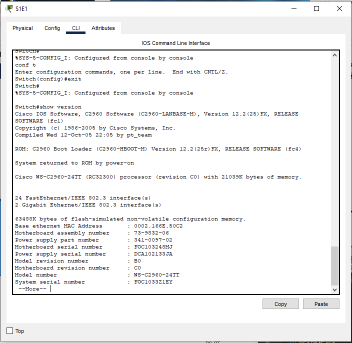
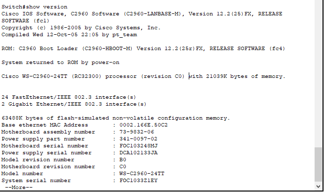
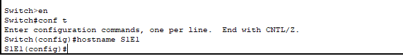
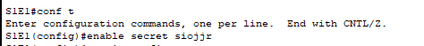
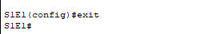
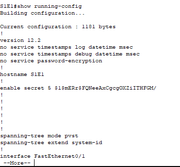
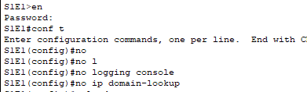
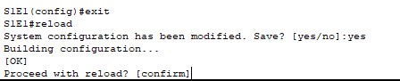

#  Routage Inter VLAN

## Introduction 

Pour l'introduction au routage inter Vlan un lan a rapidement été crée.

Le contexte :

Sur packet tracer :

Le port Fa0/24 de S1E1 permet de relier le routeur RTR_LAN port FA 0/0.

Le routeur PF1 est relié sur les ports de S1E1 dans le VLAN 30 et le VLAN 60.

## L’environnement CLI (console line interface)

Les différentes commandes pour configurer les vlans sur les switchs de niveau 2 seront faîtes via l'OS du switch(IOS) un terminal dans l'onglet CLI est mis à notre disposition.

CLI :

il y a 2 status :

Utilisateur simple prompt = > 

Super-utilisateur prompt = #

Pour passer en mode super-utilisateur il faut taper la commande en.

Pour vérifier la version du matériel je la show version :

Sur les appareils Cisco les configs se font toujours depuis le mode config et ses sous modes.

certaines commandes marchent qu'en "enable" ex show.

pour enlever une commande, il suffit d'utiliser ma commande no suivie de la commande à retirer.

je suis d'abord passé en mode super-utilisateur, j'ai ensuite activé le mode terminal.

pour changer le nom de l'appareil je tape la commande hostname suivi du futur nom.

Pour protéger le mode enable, il est nécessaire de mettre un mot de passe chiffré avec la commande enable secret le mot de passe.

Je configure mes appareils pour ne plus faire apparaître les logs à l'écran et pour éviter une recherche DNS extérieur systématique (en cas d'erreur de commandes) :

Je pense bien évidemment à redémarrer le switch, pour sauvegarder les modifications :

## Création de VLAN