# Tp Routage

## Contexte

Schéma Logique:
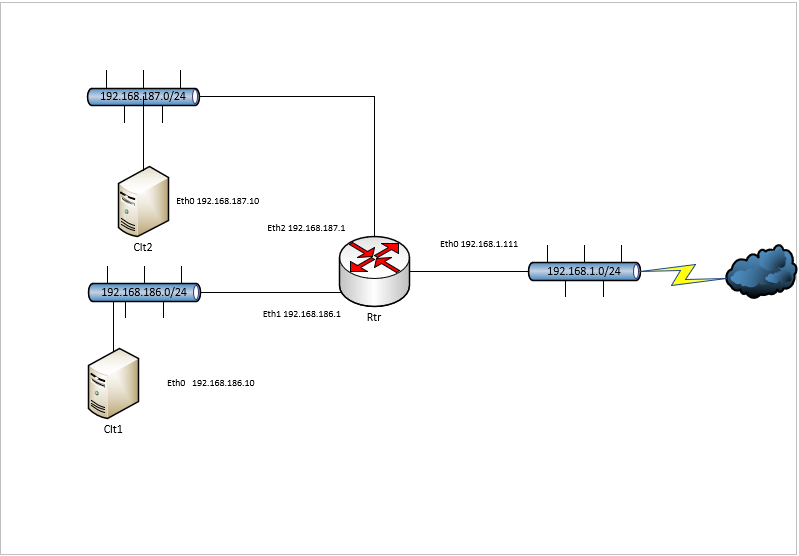

Sur le logiciel de virtualisation hyperV je crée des commutateurs virtuel que pour les attribuer à mes machines:

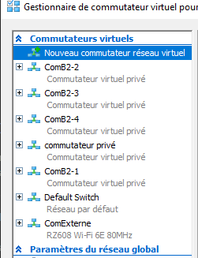

Config hyperV de mon routeurWeb:

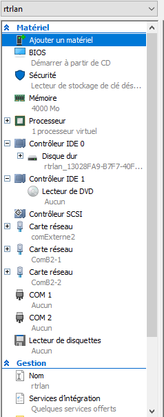

 ## I. Configuration et clonage de machines Linux pour créer un serveur et des clients.
Pour configurer mes différentes interfaces j'edite le fichier /etc/network/interfaces.

Je vais sur le routeur privé je configure mes différentes interfaces en leurs attribuant une adresse statique:

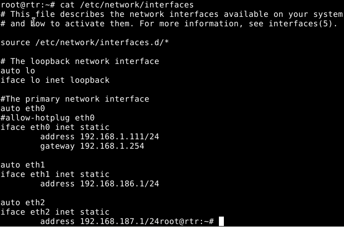.

Pour mettre à jour ma config je redémarre le service réseau avec la commande systemctl restart networking.

Je tape la commande ip a pour vérifier que ma config a bien été prise en compte:

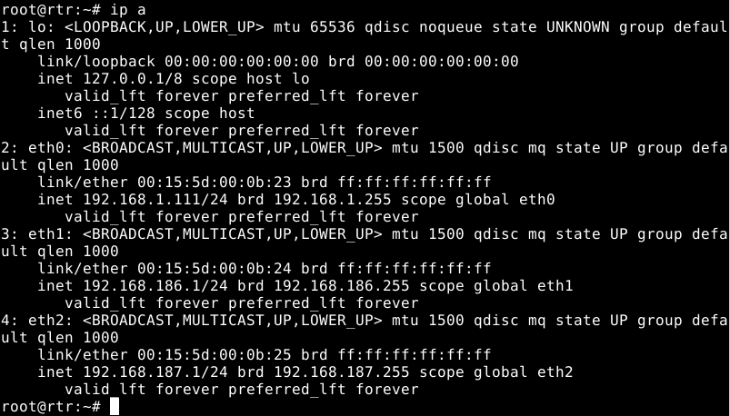

Tables de routage des clients après les configurations:

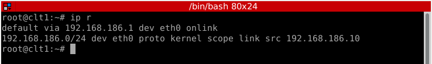

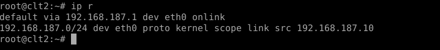

je pense toujours à relancer le service réseau après chaque modification du fichier de conf des interfaces.

Test de communication:
client1 vers client2:

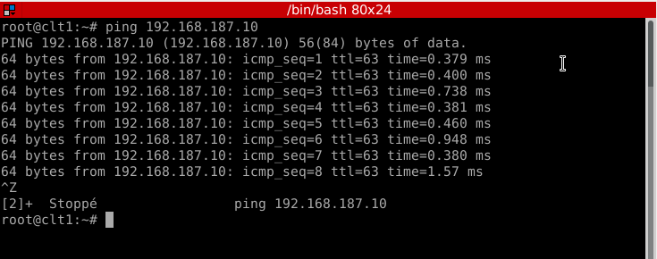

client2 vers client1:

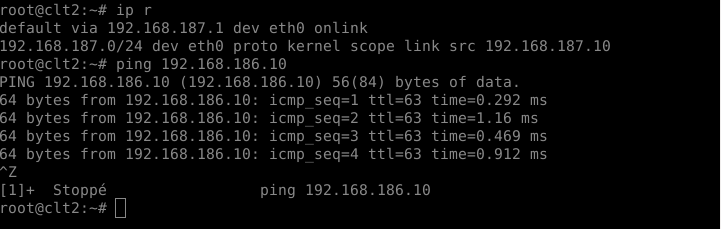

## II. Configuration du routage.

Pour activer le routage, il faut editer le fichier /etc/sysctl.conf:
en retirant le '#' à la ligne : net.ipv4.ip_forward=1

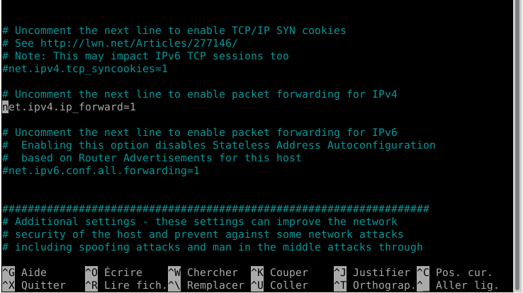

Il faut ensuite relancer le service avec la commande: systemctl restart procps

La table de routage de mon routeur privé:

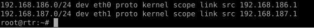

Nous allons utilisez un logiciel(Wireshark) permettant d’observer les trames circulant sur le routeur (ping client1 vers client2).

trame sur l'interface eth0 du routeur:

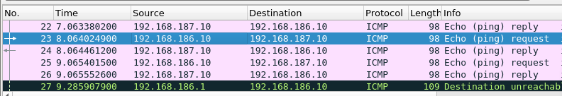

Le tableau ci-dessous (ping client1 vers client2):

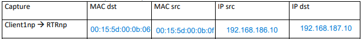

trame sur l'interface eth1 du routeur:

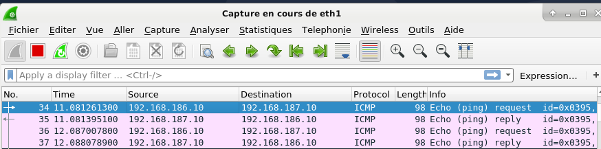

Le tableau ci-dessous (ping client1 vers client2):

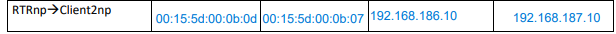

L’Address Resolution Protocol (ARP, protocole de résolution d’adresse) est un protocole utilisé pour associer l'adresse de protocole de couche réseau (typiquement une adresse IPv4) d'un hôte distant, à son adresse de protocole de couche de liaison (typiquement une adresse MAC).

Les trames sélectionnées en bleu sont des trames ARP.

## III. Routage vers l’extérieur et Internet

Je vais sur la machine de mon routeurweb qui me sert à communiquer avec internet avec la commande ip a je vois les différentes carte réseau sur ma machine.

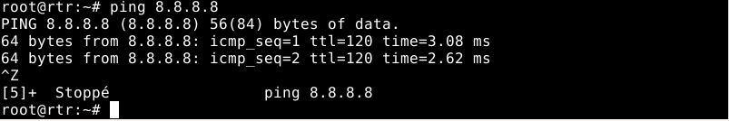

L'interface eth0 est la seul qui possède une adresse ip, pour vérifier qu'elle communique avec internet, je tape la commande ping 0.0.0.0.

Pour trouver les adresses de ma machine je tape la commande ip r qui m'affiche la table de routage.

Pour configurer mes différentes interfaces j'edite le fichier /etc/network/interfaces

j'attribue des adresse statique à chaque interfaces:

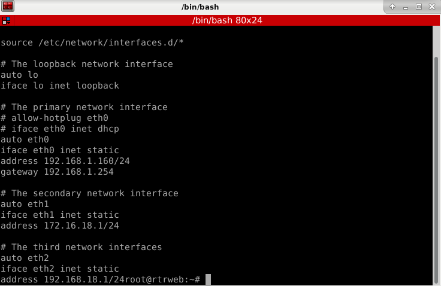

je redémarre le service réseau avec la commande systemctl restart networking.

J'active le routage, en editant le fichier /etc/sysctl.conf et je tape la commande systemctl restart procps pour relancer ce service.

Je configure ma dernière interface sur mon routeur privée: 

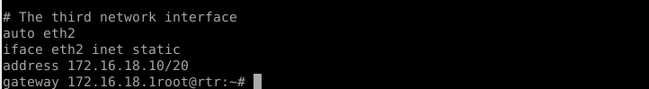

Configuration de l'interface de mon 3ème client:

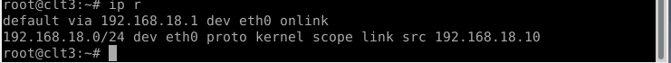

Pour que mes machines communiquent avec internet il est nécessaire de rajouter des routes sur mon routeur Web.

Avant il est nécesaire de configurer les fichiers de confs sshd_config de mes routeurs:

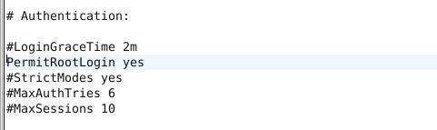

Depuis mon routeur privé je vais connecter à distance par ssh vers mon routeur web:

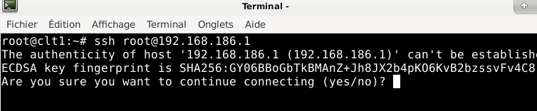

La connexion:

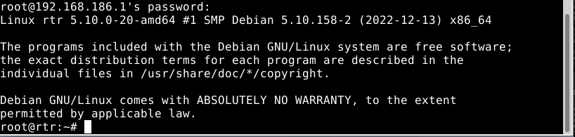

Je rajoute les routes:

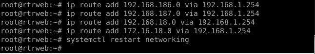

Pour continuer, il faut configurer le pare feu du routeur qui sera fait dans un prochain tp.