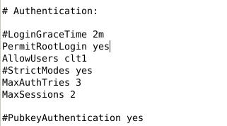

# Tp Routage

## Contexte

Schéma Logique:

Sur le logiciel de virtualisation hyperV je crée des commutateurs virtuel que pour les attribuer à mes machines:

Config hyperV de mon routeur:

 ## I. Configuration et clonage de machines Linux pour créer un serveur et des clients.
Pour configurer mes différentes interfaces j'edite le fichier /etc/network/interfaces.

Je vais sur le routeur je configure mes différentes interfaces en leurs attribuant une adresse statique:

.

Pour mettre à jour ma config je redémarre le service réseau avec la commande systemctl restart networking.

Je tape la commande ip a pour vérifier que ma config a bien été prise en compte:

Tables de routage des clients après les configurations:

je pense toujours à relancer le service réseau après chaque modification du fichier de conf des interfaces.

Test de communication:
client1 vers client2:

client2 vers client1:

## II. Configuration du routage.

Sur mon routeur :

Pour activer le routage, il faut editer le fichier /etc/sysctl.conf:
en retirant le '#' à la ligne : net.ipv4.ip_forward=1

Il faut ensuite relancer le service avec la commande: systemctl restart procps

La table de routage de mon routeur :

Nous allons utilisez un logiciel(Wireshark) permettant d’observer les trames circulant sur le routeur (ping client1 vers client2).

trame sur l'interface eth0 du routeur:

Le tableau ci-dessous (ping client1 vers client2):

trame sur l'interface eth1 du routeur:

Le tableau ci-dessous (ping client1 vers client2):

L’Address Resolution Protocol (ARP, protocole de résolution d’adresse) est un protocole utilisé pour associer l'adresse de protocole de couche réseau (typiquement une adresse IPv4) d'un hôte distant, à son adresse de protocole de couche de liaison (typiquement une adresse MAC).

Les trames sélectionnées en bleu sont des trames ARP.

## III. Routage vers l’extérieur et Internet

Je vais sur la machine de mon routeur, avec la commande ip a je vois les différentes interfaces sur ma machine.

L'interface eth0 nous permet de communiquer avec l'extérieur, pour vérifier qu'elle communique avec internet, je tape la commande ping 8.8.8.8 :

Pour que mes machines communiquent avec internet, il est nécessaire de rajouter des routes sur mon routeur.

Avant cela, il est nécesaire de configurer le fichier de conf sshd_config de mon routeur:

J'autorise le client, à se connecter à distance à mon routeur et je pense à redémmarer le service ssh avec la commande systemctl restart ssh.

Depuis mon client1 je vais me connecter à distance par ssh à mon routeur :

La connexion:

Je rajoute les routes:

ip route add 192.168.186.0 via 192.168.1.111

ip route add 192.168.187.0 via 192.168.1.111

Pour continuer, il faut configurer le pare feu du routeur qui sera fait dans un prochain tp.