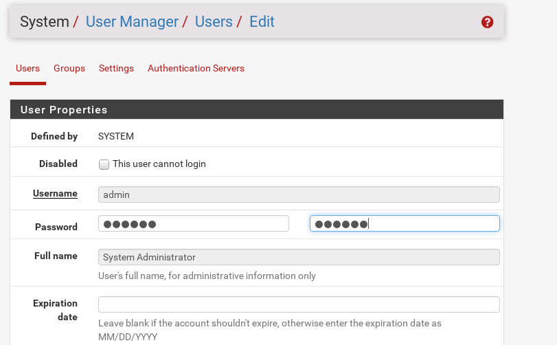
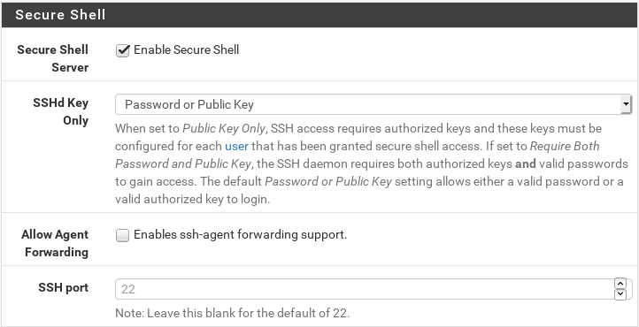
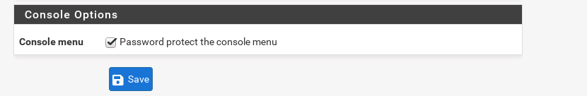

# Routeur/Pare-feu Pfsense

<b>Pare-feu</b> : firewall en anglais est un dispositif de sécurité informatique conçu pour protéger un réseau informatique en contrôlant les flux de données qui y entrent et en sortent. Il agit comme une barrière de sécurité entre un réseau privé interne (comme un réseau d'entreprise ou un réseau domestique) et des réseaux externes (comme Internet) pour empêcher les accès non autorisés ou les attaques malveillantes.

Le pare-feu analyse le trafic réseau en fonction de règles prédéfinies et détermine quels paquets de données doivent être autorisés à passer et lesquels doivent être bloqués. Il peut examiner divers aspects du trafic, tels que les adresses IP sources et de destination, les ports réseau, les protocoles de communication, les types de données, etc.

<b>DMZ</b> :  est une partie d'un réseau informatique qui est spécialement configurée pour héberger des services accessibles depuis Internet tout en étant séparée du réseau interne principal. Elle agit comme une zone tampon sécurisée entre le réseau interne et le monde extérieur.

La principale raison d'utiliser une DMZ est d'isoler les services accessibles depuis Internet afin de réduire les risques potentiels pour le réseau interne. Les services couramment hébergés dans une DMZ comprennent les serveurs Web, les serveurs de messagerie, les serveurs FTP, les serveurs DNS, etc...

Schéma logique :

## adressages 

interface em0(wan) pare-feu : 192.168.122.136

interface em1(lan) pare-feu : 192.168.1.1

interface em2(dmz) pare-feu : 192.168.2.1

webterm-1 (wan) : 192.168.122.130

webterm-2 (lan) : 192.168.2.2

PC1 (lan) : 192.168.1.3

serveur web de la dmz : 192.168.2.2

## Paramétrage Pfsense :

Il faudra ensuite redémmarer le pare-feu en selectionnant reboot.

Nous donnons une ip statique au pc1 :

De même pour le webterm-2 :

Via notre webterm-2 connectons nous à notre GUI pfsense :

Nous apporterons quelques modifications :

Pour sécuriser notre pare-feu, nous changeons le mot de passe par défaut de pfsense par un mot de passe sécurisé (12 caratères avec des majuscules, minuscules, chiffres et caractères spéciaux) :

Pour se connecter via un shell à notre nous activons l'authentification SSH, nous pouvons aussi changer le numéro  port ssh et mettre en système de clés pour l'authentification :

Depuis le shell de notre webterm-2  tentant de nous connecter via ssh à notre pare-feu :

C'est un succès, nous pouvons vor nous 2 interfaces :

Nous avons ajouté une nouvelle interface celle de la dmz.

Cette commande permet d'ouvrir tous les ports sur l'interface WAN, il est important de penser à les refermer à la fin :

Nous pouvons voir nos 3 interfaces :

Configurons l'interface de notre dmz :

Dans l'onglet système puis routing, nous pouvons faire du routage :

Nous avons hébergé un site sur notre serveur web, nous tentons d'y avoir accès depuis le lan :

Pour illuster le fait que les adresses privé ne sont pas routables sur internet, nous mettons en place du nat, dans un cas réel l'interface coté wan est une ip publique : 

Si un utilisateur coté wan essaye d'avoir 
accès à notre serveur web, il devra saisir l'ip de l'interface wan du pare-feu.

Pour les règles de nos différentes interfaces, nous prenons le temps de tous bloquer, puis autorisons seulement ce qui est nécessaire :

Essayons depuis webterm-1 d'avoir accès au site de notre dmz :

