# Routeur/Pare-feu Fortinet 

<b>Pare-feu</b> : firewall en anglais est un dispositif de sécurité informatique conçu pour protéger un réseau informatique en contrôlant les flux de données qui y entrent et en sortent. Il agit comme une barrière de sécurité entre un réseau privé interne (comme un réseau d'entreprise ou un réseau domestique) et des réseaux externes (comme Internet) pour empêcher les accès non autorisés ou les attaques malveillantes.

Le pare-feu analyse le trafic réseau en fonction de règles prédéfinies et détermine quels paquets de données doivent être autorisés à passer et lesquels doivent être bloqués. Il peut examiner divers aspects du trafic, tels que les adresses IP sources et de destination, les ports réseau, les protocoles de communication, les types de données, etc.

<b>DMZ</b> :  est une partie d'un réseau informatique qui est spécialement configurée pour héberger des services accessibles depuis Internet tout en étant séparée du réseau interne principal. Elle agit comme une zone tampon sécurisée entre le réseau interne et le monde extérieur.

La principale raison d'utiliser une DMZ est d'isoler les services accessibles depuis Internet afin de réduire les risques potentiels pour le réseau interne. Les services couramment hébergés dans une DMZ comprennent les serveurs Web, les serveurs de messagerie, les serveurs FTP, les serveurs DNS, etc...

Schéma logique :

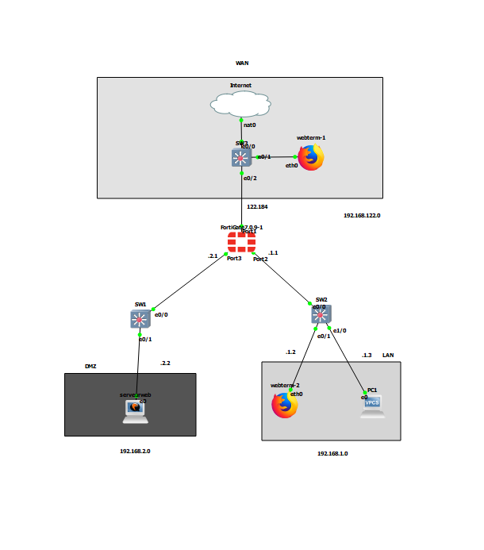

## adressages 

interface port1(wan) pare-feu : 192.168.122.184

interface port2(lan) pare-feu : 192.168.1.1

interface port3(dmz) pare-feu : 192.168.2.1

webterm-1 (wan) : 192.168.122.130

webterm-2 (lan) : 192.168.2.2

PC1 (lan) : 192.168.1.3

serveur web de la dmz : 192.168.2.2

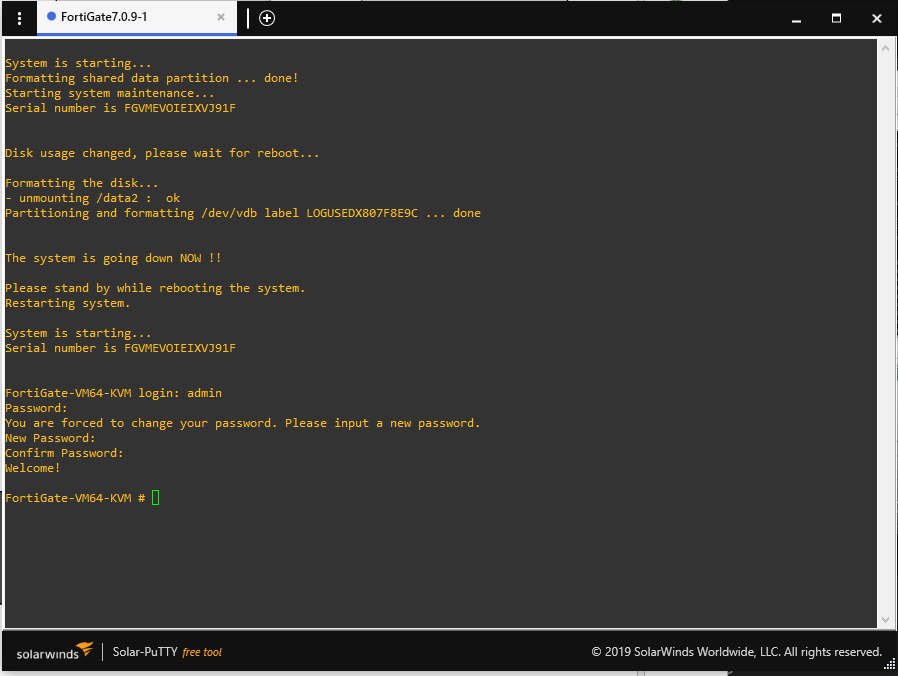

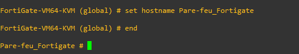

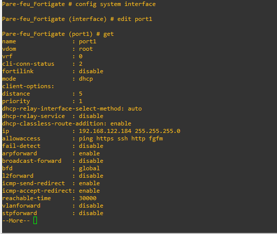

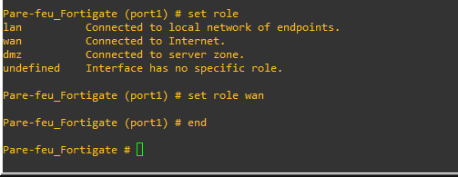

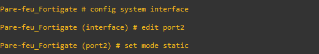

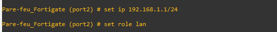

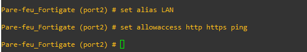

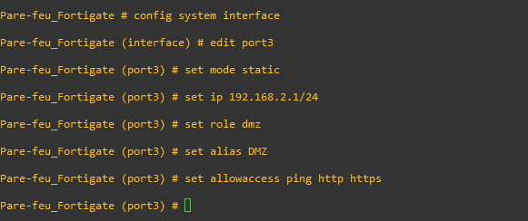

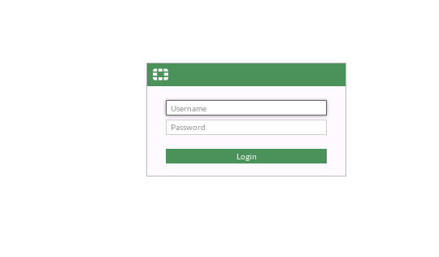

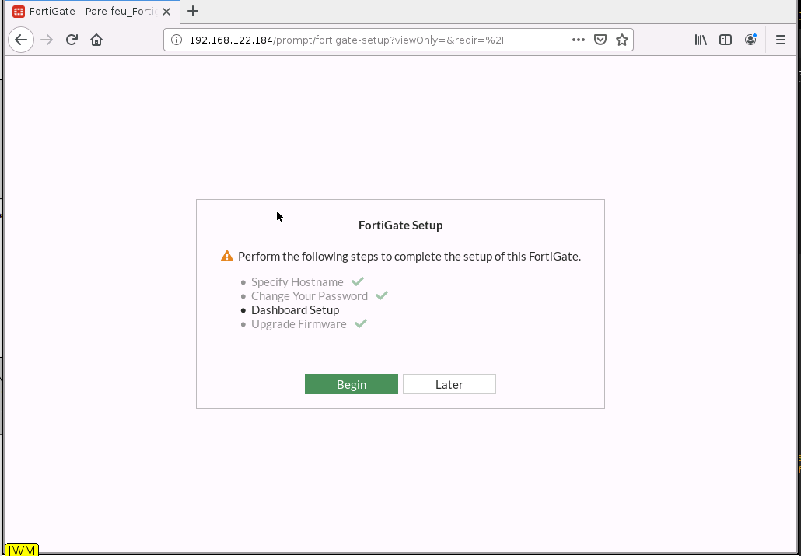

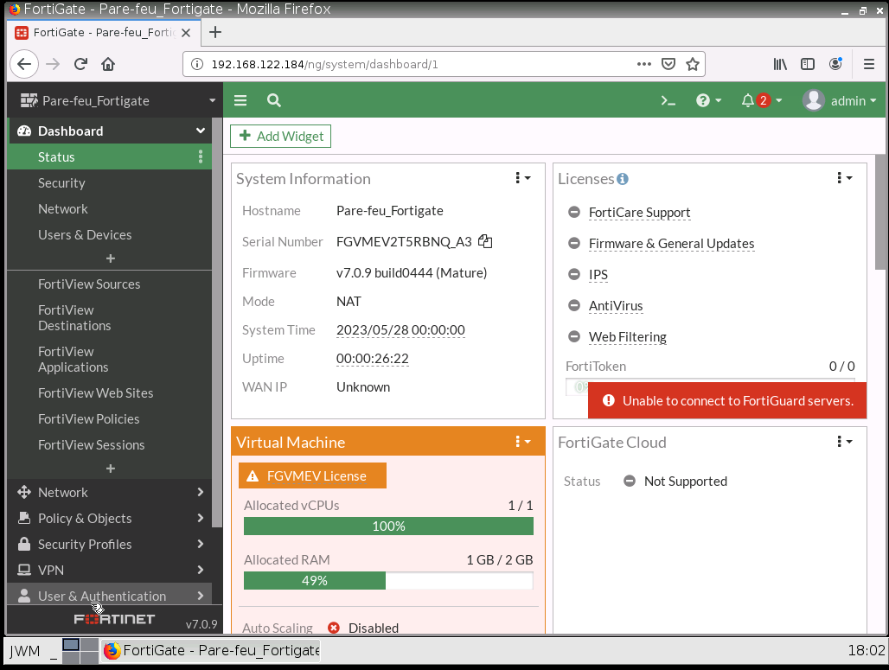

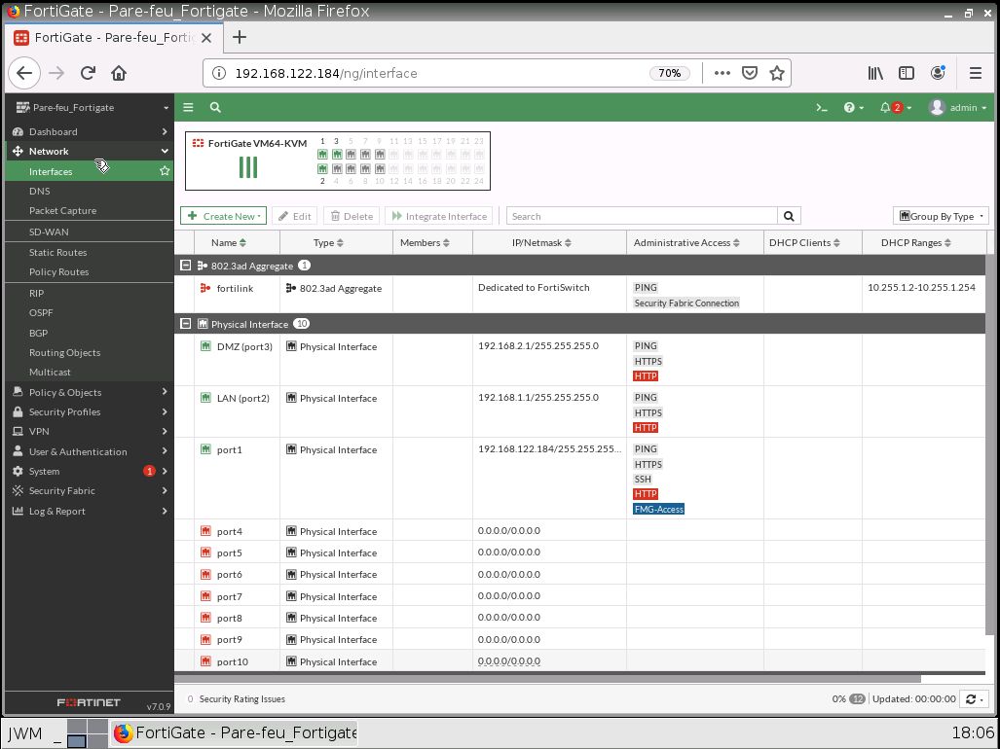
