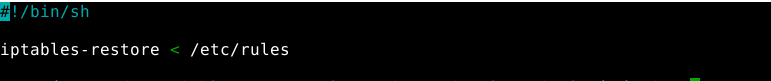

# Routeurs/Pare-feux Iptables sous Linux

## I. Installation Iptables

Pour vérifier que l'on a Iptables on tape la commande Iptables -L --line-numbers :


Nous pouvons voir qu'aucunes règles n'ont été mises en place.

Dans le cas ou la commande précédente n'est pas passée, il faudra taper la commande :

``` sh
apt-get install iptables
```
## II. Mise en oeuvre de netfilter

### a) Script de base
Pour éviter les erreurs, je vais créer les différentes règles du pare-feux dans script sh.

le script permettant de revenir à la politique de base :


le script permettant de changer la politique par défault, c'est celui dans lequel je vais travailler(parefeu_on) : 


Après ça je fais un :

``` sh
chmod +x nom du script 
```
pour qu'il soit éxécutable.

pour lancer le script je tape la commande 

```sh
./parefeu_on
```
je tape la commande 

```sh
iptables -L --line-numbers 
```
pour vérifier aucunes connexions soit autorisée par le parefeu :


### b) Filtrage 

Dans le fichier parefeu_on nous ajouterons et effecerons des règles au fur et à mesure.


Les règles :

- J'autorise la machine à communiquer avec elle même (ping sur elle même).
- J'autorise les connexions à distance ssh port 22.


- J'autorise les machines à communiquer entre elles avec le protocole icmp. 


- J'autorise les flux DNS port 53.
- J'autorise les flux DHCP port serveur 67 et client 68.
- J'autorise les flux http port 80.


- J'autorise les flux https port 443.

- J'autorise le nat dynamique, plus précisément les adresses ipv4 privée des machines de mon lan, car elles ne sont pas routables sur internet, pour communiquer sur internet une translation doit être faîtes. ex : pour communiquer sur internet, clt1(client) 192.168.186.10 utilisera l'adresse ip publique 61.61.61.61(fausse ip publique). 


Je sauvegarde mes règles pour qu'elles s'activent à chaque démarrage :



L'ensemble des règles :


Des règles pour les ports smtp, imap etc... n'ont pas été ajoutées volontairement. Elles seront ajoutées, dans les prochains comptes rendus. 

## III. Test Nmap

Nmap permet de détecter les ports ouverts sur une machine, de détecter l'os de la machine cible etc ...

### a) Parefeu activé

Sur un client j'installe nmap :


Pour tester mon parefeu, je vais lancer Nmap pour écouter les ports qui utilisent tcp depuis mon client :


sur wireshark :


Nous pouvons voir, qu'il analyse tous les ports en faisant des tentatives de connexion, pour le port 22 ssh elle est établie.

Je vais maintenant le faire pour le protocole Udp :


Nous pouvons voir, que Nmap arrive pas à déterminer si les ports sont ouverts ou filtrés.

sur wireshark :


il a forcé le protocole ARP et fait une multitude d'écoutes.

### b) parefeu désactivé

Pour le protole tcp :


Pour le protocole Udp :


Nous pouvons voir, que Nmap a trouvé les ports 67,631 et 5353 mais il arrive pas à déterminé si ils sont ouverts ou filtrés.

### c) Se protéger des scans 

Pour se protéger des scans de nmap ou autres, il existe différentes mesures à mettre en place :

- installer fail2ban qui bloque les adresses ip, tentant des authentifications frauduleuse.

- installer portsentry qui bloque les adresses ip, tentant d'identifier les ports ouverts sur une machine cible. 