# Serveur Dhcp Linux

Le protocole DHCP (Dynamic Host Configuration Protocol) est un protocole client/serveur qui fournit automatiquement un hôte IP (Internet Protocol) avec son adresse IP et d'autres informations de configuration associées, telles que le masque de sous-réseau et la passerelle par défaut.

## I- Configuration et clonage de machines Linux 
Dans notre contexte de base, nous avons un routeur, un serveur dns et des clients.

Pour la création de mon serveur DHCP je vais cloner mon serveur Dns.

Je supprime les paquets bind9 et j' attribue une nouvelle ip statique.

Sur le serveur Dhcp j'installe le paquêt :
isc-dhcp-server.

Par défaut, lors de l'installation le serveur ne peux s'activer car les plages n'ont pas encore été mise en place.

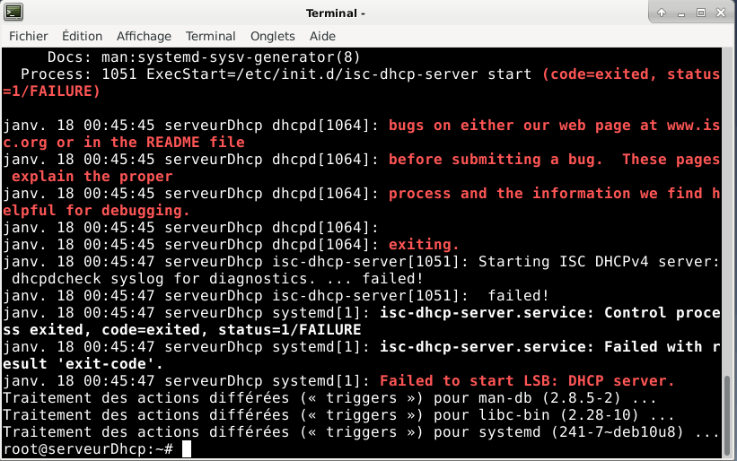

## II- Configuration du serveur dhcp

Pour configurer je vais éditer le fichier /etc/dhcp/dhcpd.conf.

Je commence d'abord par la config général :

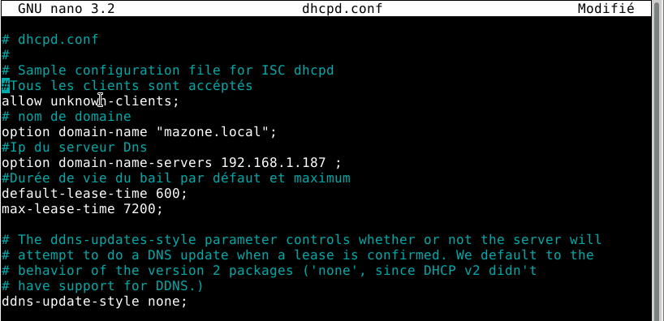

Config du sous-réseau 192.168.186.0/18 :

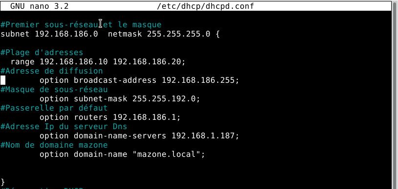

dans le fichier /etc/default/isc-dhcp-server j'indique le nom de l'interface de mon serveur dhcp dans mon cas eth0 :

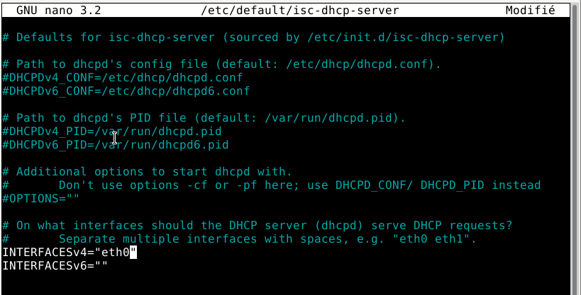

## III- Configuration des hosts :

Il arrive que l'on veut, qu'une machine ai toujours la même adresse Ip, pour cela dans le fichier de conf dhcp, on va lui résever cette adresse.

Détail : Liaison entre l'adresse IP et l'adresse mac d'une machine.

Dans le ficher /etc/dhcp/dhcpd.conf Je fais ma réservation dhcp :

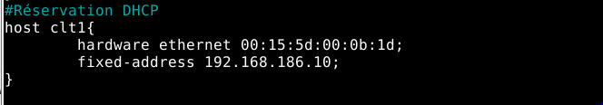

Je relance le service dhcp avec la commande systemctl restart isc-dhcp-server.

## IV - Configuration du relay Dhcp :

Sur le routeur j'installe le paquêt : 

isc-dhcp-relay.

avec la commande apt-get install isc-dhcp-relay.

Les étapes de l'installation :

ip du server dhcp :

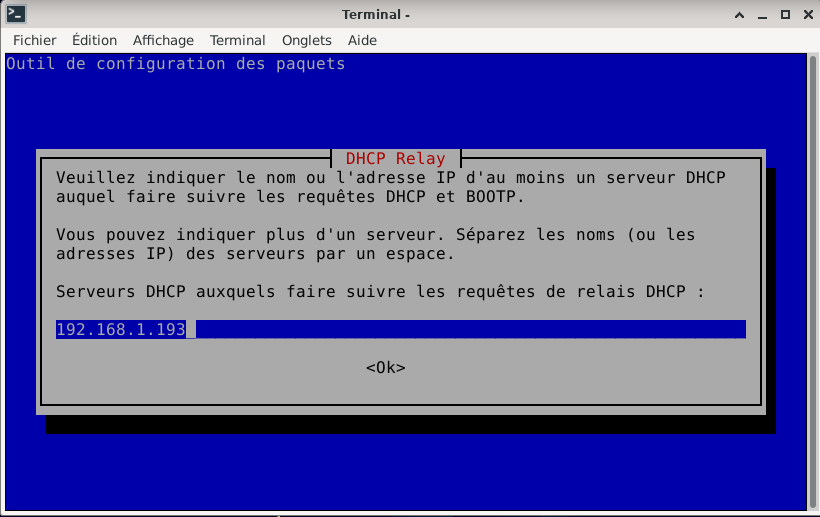

Si la configuration a bien était faites ce champ peux rester vide :

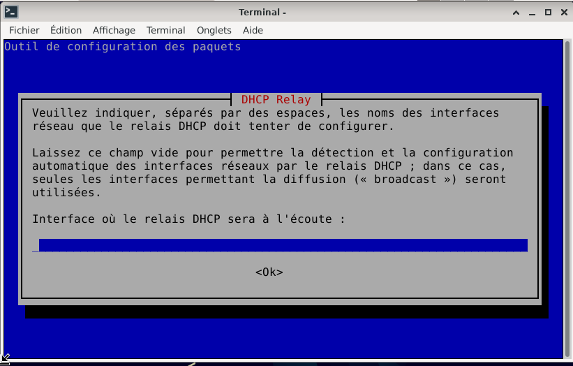

ne rien mettre :

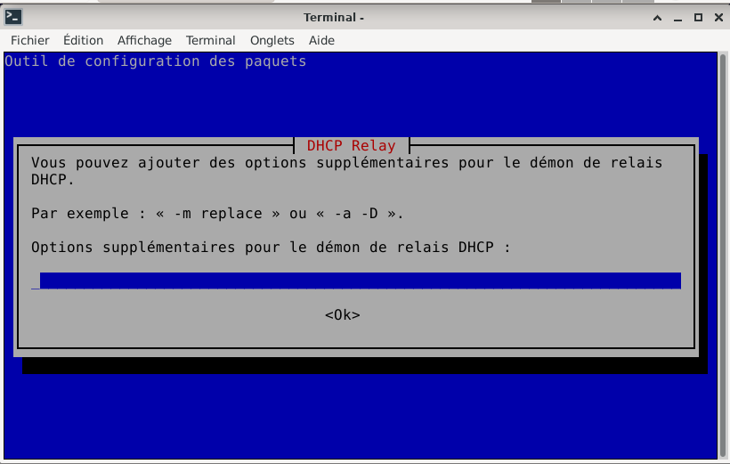

### Attention :
  si la commande systemctl restart isc-dhcp-server sur le serveur ne marche pas, il faudra tuer les processus dhcpd :

pour localiser les processus dhcpd :

commande : ps aux | grep dhcpd

puis avec la commande kill, je fais kill le numéro du processus dhcpd.

ensuite je tape la commande, rm /var/run/dhcpd.pid

et pour finir je démarre le service dhcp :

systemctl start isc-dhcp-server

## V- Configuration du client :

Premièrement, si le client est en statique, il faut le mettre en dhcp dans le fichier /etc/network/interface

je relence le service puis je tape la commande ip a

 dhcp sur un client (clt1) :

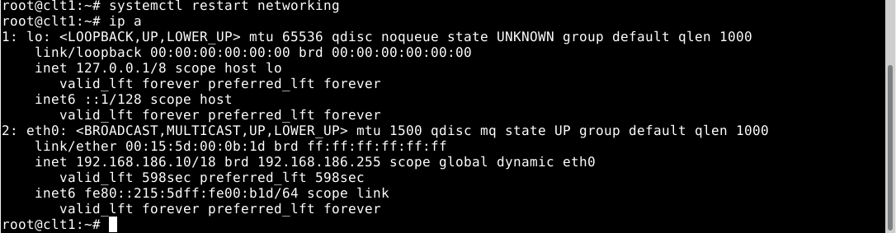

Pour aller plus loin je vais créer nouveau client :

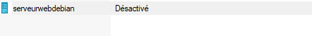

Je l'ai connecté au switch du réseau 192.168.186.0.

Je tape la commande ip a est cette machine est bien connecté au réseau 186.0 :

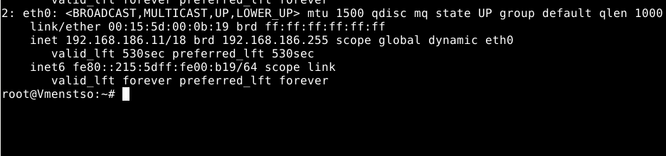

De plus il reconnait mes différents terminaux (Dns) :

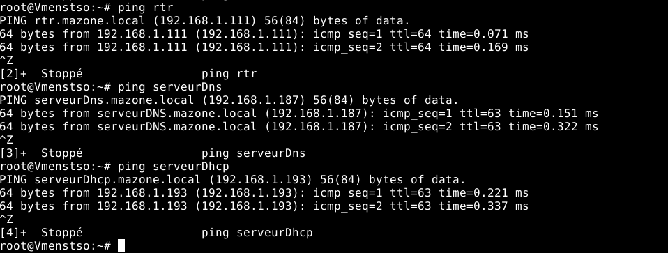

Sur le serveur dhcp j'avais configuré pour que la durée seroit de 10 min :

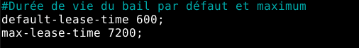

Dans le fichier conf d'inscription des baux, nous pouvons voir que le bail dure bien 10 min :

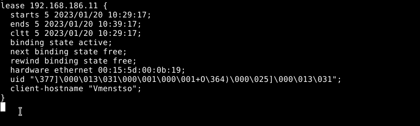

## VI - Analyse du cycle Dhcp (Dora) :

Sur Wireshark Nous allons analyser les différentes trames DHCP :

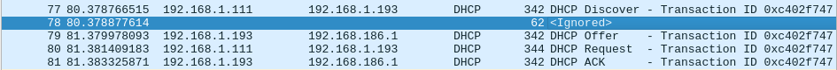

1. Le nouveau client, diffuse un paquet DHCP à l'adresse de diffusion, pour obtenir une réponse du server Dhcp. Dans notre cas, le paquet est envoyé au relais DHCP, qui est mon routeur 192.168.1.111. Le routeur transmet ce paquet, au serveur Dhcp(192.168.1.193) (Dhcp Discover).

2. Le serveur propose au client, la potentielle adresse Ip qu'il peut avoir(Dhcp Offer).

3. Ensuite, le client renvoit un paquet au serveur Dhcp(passant par le relais), pour lui indiquer qu'il accepte de  prendre cette adresse Ip et par la même occasion prévient les différents serveurs Dhcp, qu'il a accepter l'offre du serveur Dhcp(Dhcp Request).

4. Le serveur Dhcp, stocke l'adresse ip du client dans sa bdd et lui répond en lui transmettant le dernier paquet, qui finalise l'attribution de l'adresse Ip(Dhcp ACK).

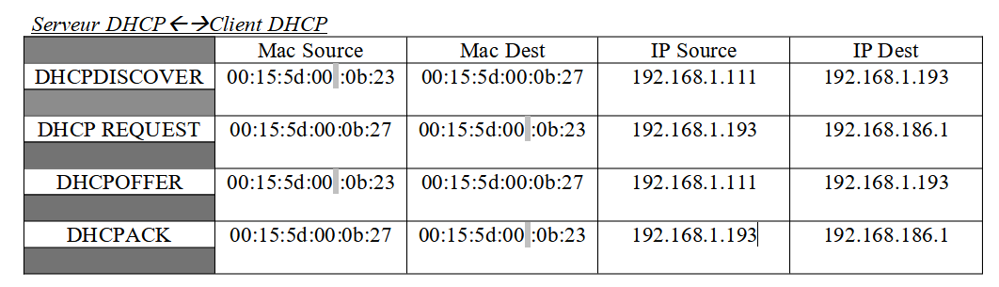

iptable -A FORWARD -i $iflan1 -o ifwan -p udp -s $lan1 --sport 68  --dport 67 -j ACCEPT
iptables -A FORWARD -i $ifwan -o iflan1  -p udp -s 192.168.1.193 --sport 68 -j ACCEPT 