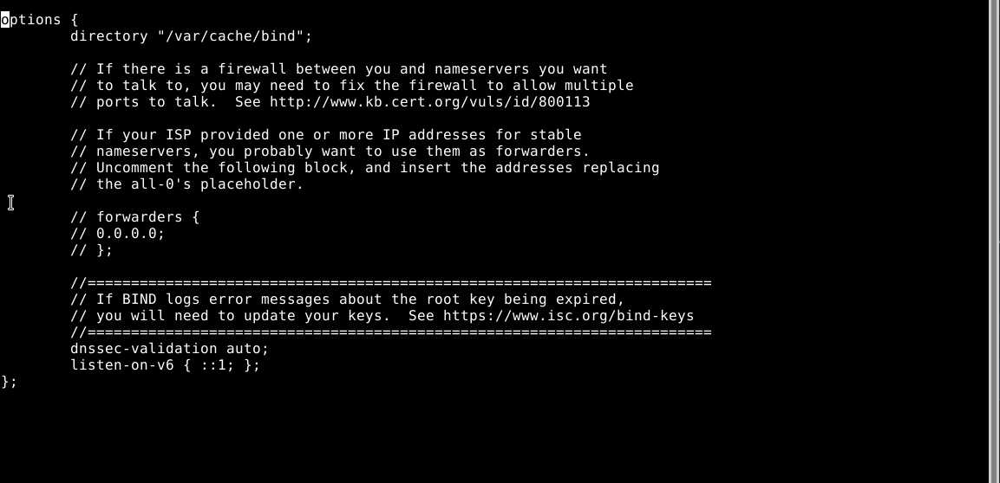
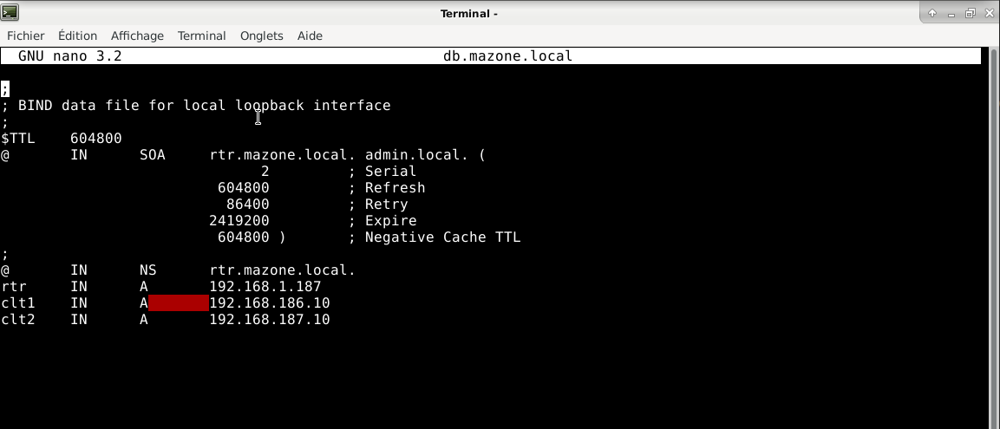
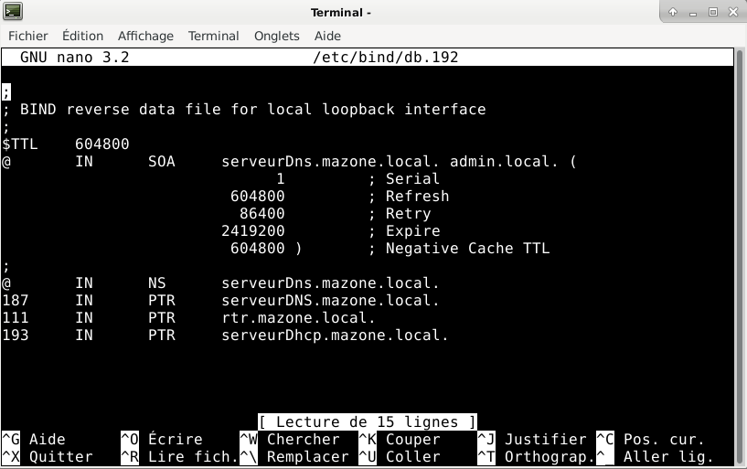
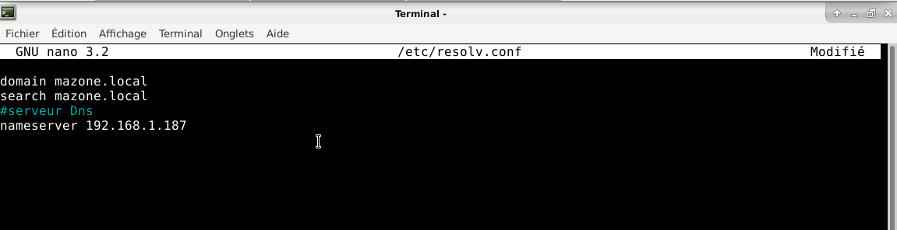
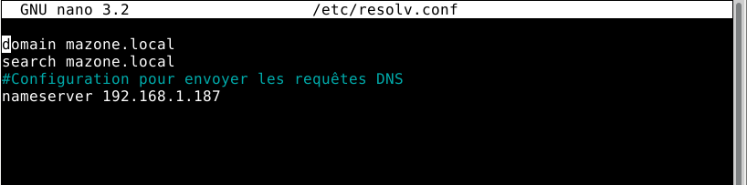

# Serveur Dns Linux

Le Domain Name System ou DNS est un service informatique distribué utilisé qui traduit les noms de domaine Internet en adresse IP ou autres enregistrements. En fournissant dès les premières années d'Internet, autour de 1985, un service distribué de résolution de noms, le DNS est un composant essentiel du développement du réseau.

## Objectifs : Gérer un domaine et ses enregistrements. Comprendre le fonctionnement des outils de tests DNS.

1 .  <u>Mise en place</u> :

Pour le serveur Dns Linux il est nécessaire d'installer les paquets bind 9 & bind 9doc.

2 . <u>Configuration de base pour votre zone Dns</u> :

Les fichiers de configuration DNS sont situés dans le répertoire /etc/bind. Le fichier de configuration de base est /etc/bind/named.conf.

La ligne include spécifie le nom du fichier contenant les options DNS.

/etc/bind/named.conf.options indique au DNS où chercher les fichiers. Tous les fichiers utilisés par BIND seront relatifs à ce répertoire.

Dans le fichier named.conf est spécifié où le serveur Dns doit récuperer les zones /etc/bind/named.conf.local :

Pour éviter tous problèmes avec l'ipv6 dans  le fichier named.conf.option à listen-on-v6 j'ajoute entre les accolades ::1; :

### configuration de ma zone personelle :

Pour cela on crée les bases de données de chaque zone. Dans chacune de ces bases on retrouve des enregistrements. La base de données de la zone direct contient les enregistrements de type A qui contiennent les correspondances noms-adresses, SOA qui indiquent l'autorité de la zone, NS qui indique un serveur nom pour la zone et CNAME qui correspond au nom canonique et la base de données de la zone inverse contient quant à elle les enregistrements SOA, NS et PTR.

* option type master, pour inscrire une nouvelle zone principale 

* option file, pour indiquer l’emplacement du fichier de zone correspondant à mon domaine DNS. . Par défaut dans /var/cache/bind

### mazone.local

Dans mon fichier de configuration de base named.conf.local je définis mes zones :

Dans mon fichier de zone db.mazone.local :

j'ai ajouté des enregistrements de type A, ex : rtr qui est mon routeur et mon serveur DNS.

Après cela je redémmare le service bind9 avec la commande systemctl restart bind9.

Je vais ensuite configurer la zone inverse :

Pour la configuration des requêtes Dns sur un serveur Dns dans le fichier   /etc/resolv.conf de mon serveur :

Pour les clients :

Pour que mes configurations soient prises en compte je relance service bind9 :

systemctl restart bind9

Test ping nom de machine du client 1 depuis le routeur(serveurDns) :

ping client 1 vers client2 :

nslookup est un outil en ligne de commande simple mais très pratique qui est principalement utilisé pour trouver l’adresse IP d’un hôte spécifique ou le nom de domaine d’une adresse IP spécifique (recherche DNS inverse).

Nous pouvons aussi verifier son fonctionnement en testant les enregistrements avec nslookup :

rtr :

client 2 :

Par défaut, mes machines lorsqu'elles ne connaissent pas un nom de domaine. La requête sera renvoyé vers le serveur dns de ma machine local qui transmettra cette requête à mon Fai si il ne l'a pas en cache.

Pour faire évoluer, mon serveur DNS je lui rajouterais une zone secondaire.

