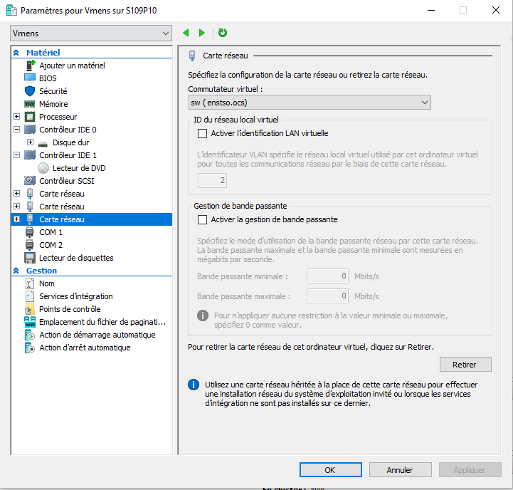
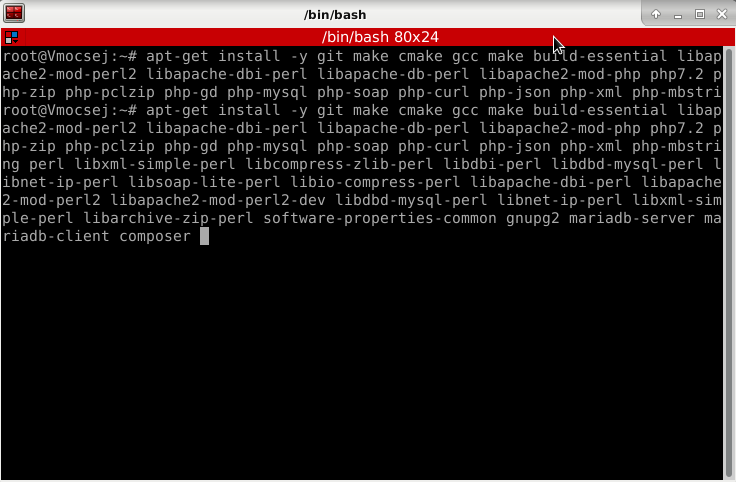

# Serveur OCS Inventory Linux

### 1/Création d’une vm

Je crée une Vm de 4Go que je liea un commutateur virtuel externe
Je lie ma Vm à un commutateur réseau virtuel type : Externe ( je choisis le sw). 
 

### 2/Installation de Debian

Au démarrage je configure ma Debian du nom de « OCS » en laissant le domaine vide L’installation va ensuite demander un mot de passe pour le superutilisateur « root » qui possède tous les droits sur le système. Mot de passe « siojjr$ ». 

Il va ensuite être demandé de partitionner le disque dur (virtuel dans notre contexte) pour installer Debian. Je sélectionne mon disque dur, je clique sur « tout mettre dans 1 seule partition » ensuite « Oui » pour confirmer les changements. Lorsque l’installation me demande s’il faut utiliser un miroir sur le réseau, je clique sur  « Non ».
Pour finir Debian me demande si je souhaite « Installer le programme de démarrage GRUB sur le secteur d’amorçage » je coche oui et je l’installe sur le périphérique /dev/sda …
Je clique sur continuer et Debian sera définitivement installé.

*Rappel Très important au lycée il est nécessaire de lier la vm au commutateur virtuel « sw ».

Après l’installation de la machine virtuelle je me connecte en tant que root.

### 3/ Configuration de l’IPV4 de notre machine virtuelle et d’apt-get

L’interface eth2 me permet d’avoir internet et de taper les commandes de ce tp :
 

### 4/ Mise à jour et installation des paquets requis pour le serveur

Avant de continuer je pense à un faire un apt-get dist-upgrade puis un apt-get update les paquets actuels du système sont à jour.

Une série de paquets devra être installé je tape la commande :

 
Cela permet d’installer un serveur web dans notre cas apache 2, des modules PHP et Perl, MariaDB et un client Mysql pour pouvoir y accéder.

### 5/ Configuration de Mariadb

Je vais maintenant préparer la base de données sur laquelle OCS sera. 
Pour cela il faut configurer MariaDB :
La commande mysql_secure_installation me permet d’exécuter le script de configuration de  mariadb
Une série de question me sera posée je mets Y à tous.

*pour plus précision sur les questions voici les explications du tp du prof : 

Pour créer une base de données pour OCS. 
J’entre sur My SQL avec la commande suivante :
Mysql -u root -p
Ensuite j’entre mon mot de passe
Ensuite je crée ma base du nom de « ocs web »

Je tape CreateDatabase ocsweb 

Ensuite cela signifie que j’attribue tous les droits sur la base de données à l’utilisateur « ocs » ayant pour mot de passe « siojjr » avec la commande GRANT ALL PRIVILEGES ON ocswebej.* TO vmocsej@localhost IDENTIFIED BY « siojjr » ;
Pour appliquer les modifications :
Je tape FLUSH PRIVILEGES ;
Et pour quitter je je tape quit

Pour verifier que ma bdd a bien été créer je tape show databases je vois ma base ocsweb :

 

### 6/ Installation d’OCS

*Attention si l’installation n’a pas été faites dans le bonne ordre il faut recommencer sinon il y aura des problèmes.

•	Serveur pour Linux/Unix 2.9.2

Après avoir téléchargé et décompressée l’archive, je mets le dossier serveur pour linux dans le répertoire /root/OCSInventoryServer  et je pense à le cloner.

Dans le répertoire où j’ai cloné OCS-ng /root/OCSInventory-Server/. Dans ce répertoire il y a le fichier setup.sh qui est notre installateur. Je l’ouvre et je modifie les informations de connexion à la base de données si nécessaire (par exemple le mot de passe de l’utilisateur OCS qui est « siojjr » est à préciser dans le fichier.) 
Il faut se rendre sur installateur executable puis il faut l’éxécuter.
Chmod u+x setup.sh
./setup.sh

La configuration de la base de données est ci-dessous :

 
Je serais ensuite accueilli par un assistant qui me posera une série de question j’ai choisie de laisser par défaut

J’execute les commandes pour activer la configuration de apache d’ocs depuis le répertoire /root/OCSInventory-Server/ je tape la commande :
a2enconf z-ocsinventory-server

restAPI d’OCS :
a2enconf zz-ocsinventory-restapi

l’Interface web OCS reports :
a2enconf ocsinventory-reports

je relance apache2 :
systemctl restart apache2.service

J’attribue la propriété des fichiers d’OCS Reports à l’utilisateur du système qui execute apache2 :
chown -R www-data:www-data /var/lib/ocsinventory-reports
Puis j’édite le fichier /etc/php/7.0/apache2/php.ini et /etc/php/7.0/cli/php.ini : pour modifier les lignes suivantes :
-	post_max_size = 100M
-	upload_max_filesize = 100M
 
 

 

 
je redémarre apache2 pour appliquer les changements :
systemctl restart apache2.service
http://<ip que vous avez défini pour le serveur>/ocsreports/install.php

Pour mon cas http://<172.16.18.237>/ocsreports/install.php
Pour l’installation OCS-NG invenory installation 

Je remplis les champs suivants de la page de configuration de la base de données d’OCS :

 
*le mot de passe est siojjr

J’appuis sur send ça été fait avec succès :
Cela fait que j’ai une bannière verte avec mon login et mon mot de passe qui sont admin

Dans la page de connexion d’OCS Je rentre ces derniers :

 
 

### 8/ Installation de l’Agent OCS

a) Installation de l’agent sous Windows

Sous Windows  je télécharge l’archive nécessaire à l’installation pour notre machine (64bits) :
•	Agent pour Windows 2.9.0.0 (64 bits)

Je l’extrais dans un dossier et je l’exécute
L’url de mon serveur est :
http://172.16.18.237/ocsinventory

Pour cette étape je pense à cocher « Immediately lunch inventory »
 

b) Installation de l’agent sous Unix (Debian)

Pour installer un agent sur (Linux) :

Il faut télécharger l’agent en cliquant sur l’archive : Agent pour Unix/Linux 2.9.0
Il faut le mettre dans le répertoire de root

•	Je me place dans le répertoire root pour décompresser l’archive je tape la commande : Agent pour Unix/Linux 2.9.0

tar -xzvf Ocsiventory-Unix-Agent-2.9.0.tar.gz

*Attention s’il y a une seule erreur de syntaxe il faudra recommencer.

Je tape perl -MCPAN -e shell
Ensuite je tape yes
Taper la commande apres le = pour chaque Cpan
Pour le Cpan 1 = install Digest::MD5
Pour le Cpan2 = install XML::Simple
Pour le Cpan3 = install Net::IP
Pour le Cpan4 = install LWP
Pour le Cpan5 = install Proc::Daemon
Pour le Cpan6 = install Proc::PID::File
Pour le Cpan7 = install Compress::Zlib
Pour le Cpan8 = install Crypt::SSLeay
Pour le Cpan9 = install LWP::Protocol::https
Pour Cpan10 = install Net::SNMP
Pour Cpan11 = install Net::Netmask
Pour Cpan12 = install Net::Ping
Pour Cpan13 = install Nmap:Parser
Pour Cpan14 = reload
Pour Cpan15 = quit
 
 

Je tape maintenant la commande : apt-get install dmidecode pciutils nmap

Je me place dans le répertoire root/Ocsinventory-Unix-Agent-2.9/

Ensuite je tape la commande perl Makefile.PL

J’installe l’agent avec la commande : apt-get install ocsinventory-agent
 
 

Pour les questions suivantes :

Je choisis http et j’entre le nom de l’hôte du serveur d’inventaire OCS :
 
 

je saisie l’URL Que j’ai mis pour mon installation sur Windows.

http://<172.16.18.237>/ocsinventory/
 

Pour définir le tag de ma machine j’édite la configuration du paquet ocsinventory-agent ci- dessous, de plus cette commande me permet de faire des modifications:

dkpg-reconfigure ocsinventory-agent 

Le tag que nous choisirons est debian1, mon 2nd est :

 

À présent l’agent est enfin configuré.

J’exécute avec la commande ocsinventory-agent —server http://172.16.18.237/ocsinventory/

 

### 9/Consultation des remontées

Pour consulter les informations relevées par l’agent OCS sur l’interface web D’OCS.

Je me reconnecte sur l’adresse : http://172.16.18.237/ocsreports/index.php
Je me reconnecte avec les identifiants admin que j’ai configuré :

User: admin

Mot de passe: siojjr

Je clique ensuite sur “All computers”

 
 

Je peux voir ce qui a été remontée.

Mes machines ont bien été remontées :
 

Pour plus d’informations je clique sur le nom en violet d’une des machines que j’ai inventoriées :
 
 