# Serveur Web Apache Sécurisation via SSL.

 Un serveur web est juste un ordinateur qui stocke, traite et livre des fichiers de site web aux navigateurs web.

Les serveurs web sont constitués de matériel et de logiciels qui utilisent le protocole de transfert hypertexte (HTTP) pour répondre aux demandes des internautes faites via Internet.(https://www.hostinger.fr/tutoriels/serveur-web)

Le port 80 est le numéro de port attribué au protocole de communication Internet couramment utilisé, Hypertext Transfer Protocol (HTTP). Il s'agit du port à partir duquel un ordinateur envoie et reçoit des communications et des messages basés sur un client Web d'un serveur Web et est utilisé pour envoyer et recevoir des pages ou des données HTML.(https://fr.theastrologypage.com/port-80)

Le port 443 est un port utilisé pour les communications sécurisées sur Internet. Il est principalement utilisé pour établir des connexions HTTPS, qui sont des connexions chiffrées basées sur le protocole HTTP. Le port 443 est crucial pour protéger les données privées des utilisateurs lorsqu’ils naviguent sur Internet, en évitant les attaques de type “man-in-the-middle” et les sites web frauduleux.(https://tt-hardware.com/pc/port-443/)

Schéma logique :


### Objectifs : 	

- Configurer une machine Linux en réseau
- installer un serveur web
- Mettre en œuvre un site Web
- Sécurisation avec un certificat pour le standard HTTPS.

## Configuration du serveur web :

enregistrement dns :


enregistrement dns inverse :


réservation de l'adresse ip auprès du serveur Dhcp :

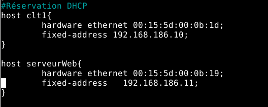

Pour que le serveur web  installe des paquets il faut autoriser les ports ftp :


Si un serveur Dns, n'a pas été mis en place il faudra éditer le fichier hosts de toutes les machines, ce qui est long est embétant si on a une centaine de machines dans le réseau.

exemple fichier hosts :
Pour la résolution du nom du serveur web, nous pouvons éditer le fichier /etc/host et ajouter cette ligne :

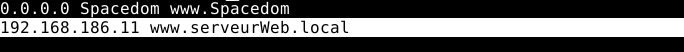

## Installation et configuration de base d'apache2 :

il faut installer différents paquets apache2, apache2-utils, mariadb-server, php7.4, php7.4-mysql

Pour télécharger php7.4 :

```sh
sudo apt -y install lsb-release apt-transport-https ca-certificates
``` 

```sh
wget -O /etc/apt/trusted.gpg.d/php.gpg https://packages.sury.org/php/apt.gpg
```
```sh
echo "deb https://packages.sury.org/php/ $(lsb_release -sc) main" | sudo tee /etc/apt/sources.list.d/php.list
```
```sh
 apt-get update
```
```sh
apt -y install php7.4
```

Je crée le répertoire de mon site dans /var/www/ :

```sh
mkdir /var/www/monsite
```

je crée deux pages Web une en html, l’autre en PHP :

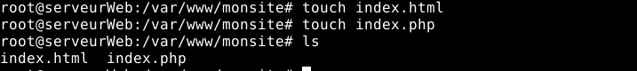

Ensuite je crée le fichier de configuration de mon site :

```sh
touch /etc/apache2/sites-available/monsite.conf
```
Je configure, mon virtual host dans mon fichier de conf :

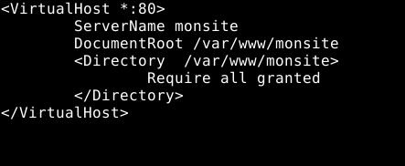

``` sh
ServerName monsite 	# FQDN permettant l’accès au site
DocumentRoot /var/www/monsite # répertoire de base des pages HTML
<Directory /var/www/monsite> #droit d’accès au pages donc au site !
	Require all granted	#Autorisation pour tout le monde
</Directory>
```
Pour activer le site il faut taper la commande :

```sh
a2ensite monsite.conf
```

cette commande permet d'activer un site, qui est lié à un fichier de  conf qui contient un virtual host et cela crée un lien symbolique dans  /etc/apache2/sites-enabled/

Pour désactiver le site il faut taper la commande :

```sh
a2dissite monsite.conf
```

On recharge le service apache2.

```sh
systemctl reload apache2
```

Test depuis mon routeur en http :


Dans le fichier de conf, nous pouvons choisir avec qu'elle index notre site doit démarrer avec la directive DirectoryIndex :


Pour le test, j'ai mis l'index.php du répertoire de notre site.

au démarrage :

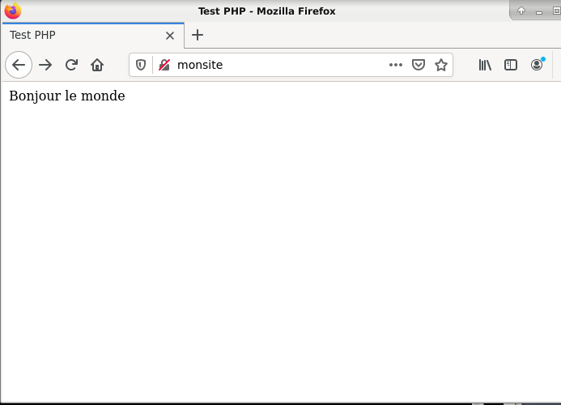


## Sécurisation du site avec HTTPS et SSL - Création de certificat autosigné pour le serveur.

•	SSL nécessite l’installation principale du paquetage openssl.

Pour l'installer :

```sh
apt-get install openssl
```

Je crée les répertoires :

```sh
mkdir /var/www/secure
```

```sh
mkdir /var/www/secure/newcerts
```
Dans le répertoire /var/www/secure je crée les fichiers serial & index.text :

```sh
touch  /var/www/secure/serial
```

```sh
touch  /var/www/secure/index.txt
```

Dans serial, j'inscris le nombre héxadécimal 01 :


### Pour la configuration de ssl :

SSL et TLS sont deux protocoles cryptographiques qui permettent l’authentification, et le chiffrement des données qui transitent entre des serveurs, des machines et des applications en réseau (notamment lorsqu’un client se connecte à un serveur Web). Le SSL est le prédécesseur du TLS.(https://www.globalsign.com/fr/blog/difference-entre-ssl-et-tls)

Dans le fichier /etc/ssl/openssl.cnf :


Je modifie la valeur, de la variable dir pour lui indiquer, le répertoire de stokage des certificats  :


Je vais créer le certificat autosigné, car je ne dispose pas d'une autorité de certification.

Dans un premier temps, je génére la clé privée :

```sh
openssl genrsa -des3 -out monsiteCA.key 2048
```

Lors de la génération, il est demandé une passphrase. Elle nous servira pour signer les certificats :

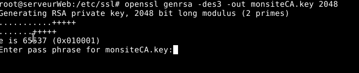

Maintenant que j'ai la clé, je vais générer le certificat autosigné:


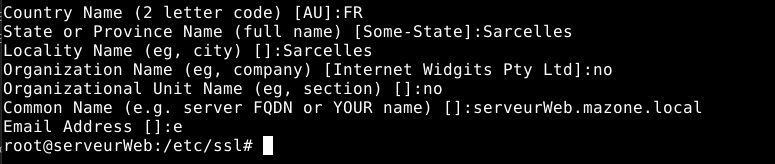

Dans un contexte serieux, les informations saisies devront être correct. De plus pour Common Name, il est important de spécifier le fqdn du serveur web qui héberge le site.

Ce certificat durera 1mois.

Le chiffrement RSA est un algorithme de cryptographie asymétrique, c'est à dire qu'il repose sur le système de clé privée et clé publique.

Exemple :

Madame A veut communiquer avec Monsieur B.

Madame A envoit sa clé publique à monsieur B et inversement.

Pour envoyer un message à monsieur B, Madame A chiffre le message avec la clé publique de monsieur B puis l'envoi.

Le message sera déchiffrée avec la clé privée de monsieur B.

Grâce à une autorité de certification, cela permet de garantir la confidentialité des données, c'est à dire que les données soit accessible seulement qu'à ceux qui ont été autorisé à les voir.

Rappel : ssl est aujourd'hui obselète, il est important d'utiliser TLS.

## Site en https :

Pour que  le protocole SSL marche sur notre serveur web, il faut l'activer avec la commande :

```sh
a2enmod ssl
```

Ajout du nouveau virtual host :

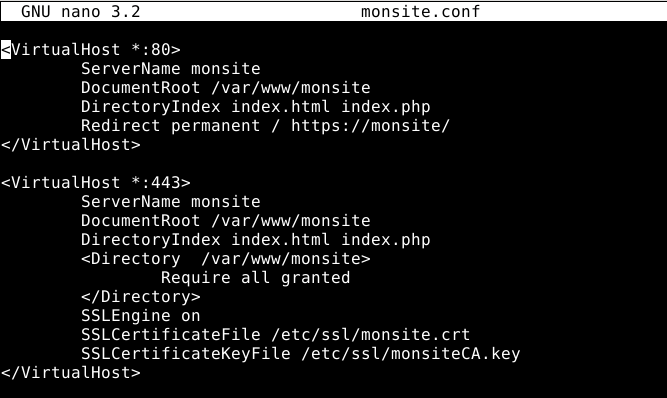

``` sh
<VirtualHost *:80>
ServerName monsite 	# FQDN permettant l’accès au site
DocumentRoot /var/www/monsite # répertoire de base des pages HTML
DirectoryIndex index.html index.php #Sur quel index démarrer
Redirect permanent / https://monsite/ #Si connexion http rediction sur le site en https
</VirtualHost>

<VirtualHost *:443>
ServerName monsite 	# FQDN permettant l’accès au site
DocumentRoot /var/www/monsite # répertoire de base des pages HTML
<Directory /var/www/monsite> #droit d’accès au pages donc au site !
	Require all granted	#Autorisation pour tout le monde
</Directory>

SSLEngine on #Activation ssl
SSLCertificateFile /etc/ssl/monsite.crt #Fichier du certificat ssl
SSLCertificateKeyFile /etc/ssl/monsiteCA.key #Fichier qui contient la clé privée de mon certificat
</VirtualHost>
```

Test sur mon routeur en https :


La connexion est dites non sécurisée :

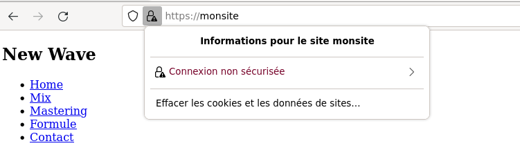

Car elle n'a pas été certifiée par une autorité officielle :

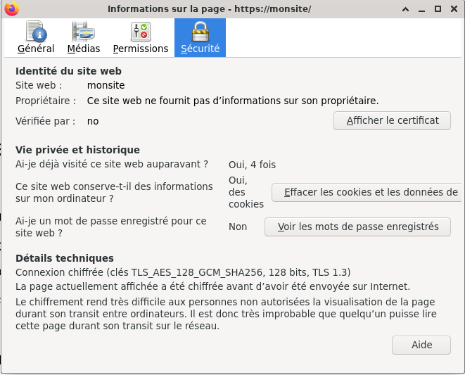

Vérifiée par la fausse organisation "no" que j'ai indiqué lors de l'auto signature de mon certificat.

le certificat :

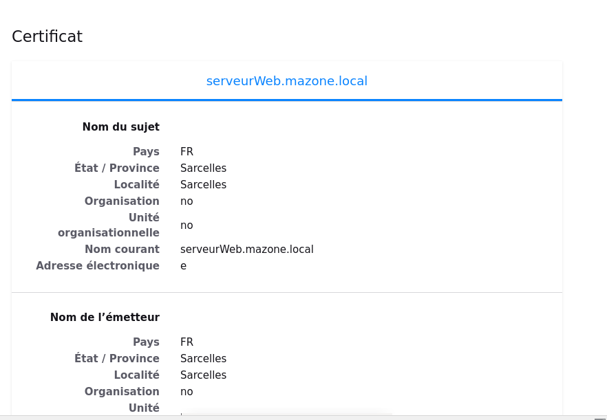