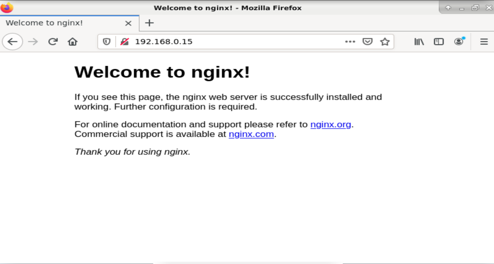
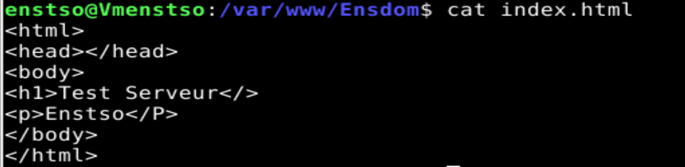
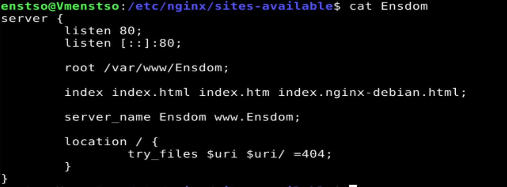
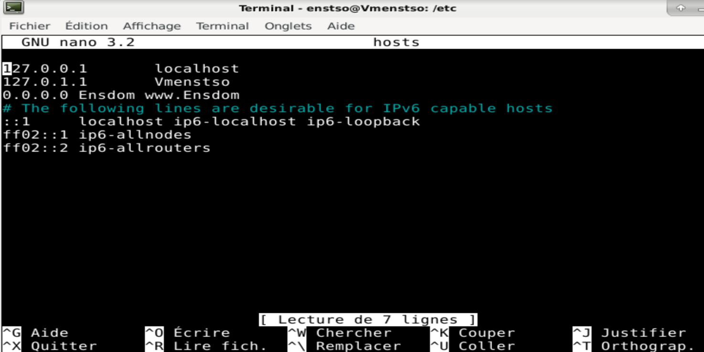
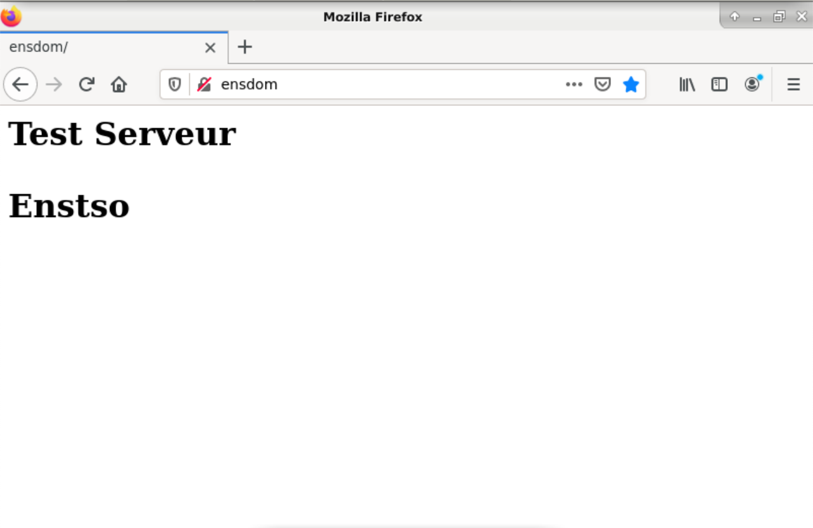
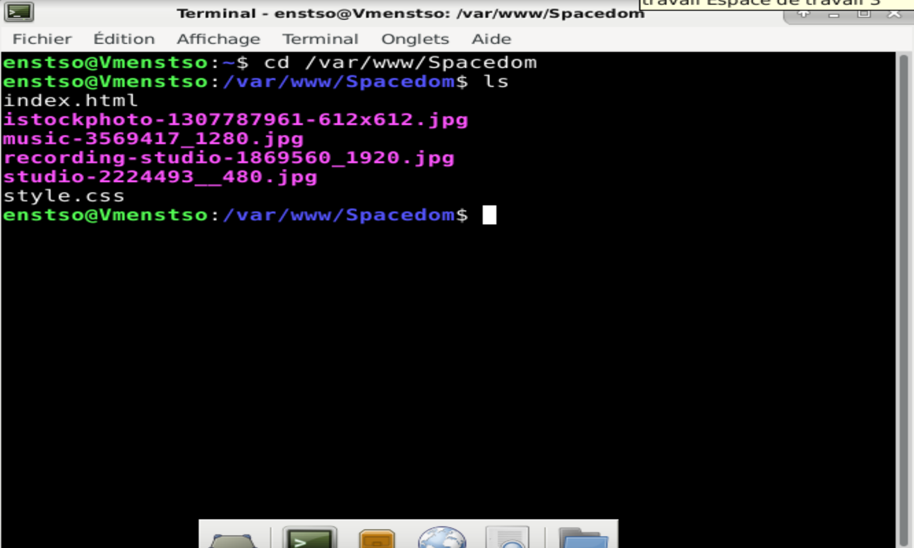
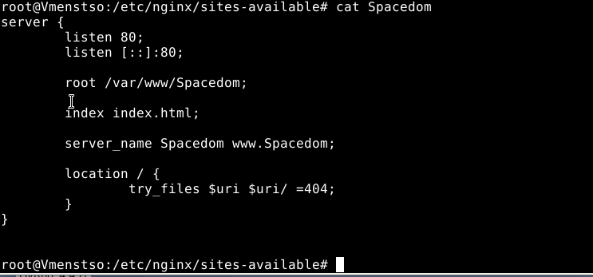
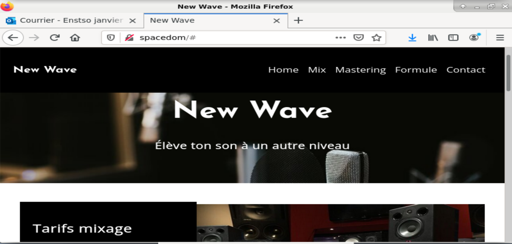

# Serveur Web NGINX Linux

### Pour créer une Vm Debian 10 :

### Sur Virtualbox :
J’ai utilisé un logiciel de virtualisation du nom de Virtualbox. j’ai mis le nom de ma futur Vm, le type qui est Linux et la version est Debian 10 64bits. Taille de mémoire (ram) 2000mo, j’ai opté pour un disque Vhd pour qu’elle soit compatible avec Hyper v. J’ai choisi la taille fixe. La taille du disque est de 8Go j’ai ensuite insérer mon fichier image iso qui est une debian10 64 bits netinst Puis j’ai lancer la Vm.

### Sur Virtualbox dans Debian10 :

*Très Important Debian doit avoir accès à Internet.
Premièrement je choisie Graphical install pour avoir l’interface graphique.
J’ai choisi la langue par défaut/clavier/situation géographique: France.
Je donne un nom à la machine/un nom pour le superutilisateur  « root » ensuite je rentre un mot passe siojjr$ je fais de même pour l’utilisateur standard. Pour partitionner les disques je choisie la méthode de partitionnement : Assisté -utiliser un disque entier le disque que je veux partitionner et celui que j’ai créée juste avant sur Virtualbox. Pour l’étape schéma de partitionnement : je choisie « Tout dans une seule partition (recommandé pour les débutants) » Ensuite je choisie « Terminer le partitionnement et appliquer les changements ». Il sera demandé s’il faut « appliquer les changements sur le disque » je coche oui pour que tous ce que j’ai fait s’applique ensuite ça installera le système de base et d’autre de fichiers/paquets. Ça demandera si j’ai l’envie d’analyser un autre Cd je coche non. Le pays du miroir de l’archive Debian est France ensuite je choisie le miroir ftp.fr.debian.org  Dans le Mandataire HTTP je ne mets rien à pars si sur mon réseau il y a un proxy. Différents paquets s’installeront Debian récupère des paquets qui sont sur Internet. « Souhaitez-vous participer à l’étude statistique sur l’utilisation des packages » je coche Non. Pour les « Logiciels à installer » je coche l’environnement de bureau debian/ je coche « xfce » qui est une interface ensuite je coche « utilitaires usuels du système » Ensuite de nombreux fichier seront récupérée sur internet et téléchargé. Pour finir Debian me demande si je souhaite « Installer le programme de démarrage GRUB sur le secteur d’amorçage » je coche oui et je l’installe sur le périphérique /dev/sda …
Je clique sur continuer et Debian sera définitivement installé.

### Pour créer un serveur web nginx dans Debian 10 :

Pour créer mon serveur web je vais avoir besoin du logiciel du nom de Nginx qui est un logiciel libre de serveur web.
*sudo = pouvoir de root de manière temporaire pour que certaines commandes se fassent.

### Étape1 Installation des paquets 

Je me connecte en tant que enstso.
Avant toutes manipulation, je mets à jour les paquets avec un sudo apt-get update
et sudo apt-get upgrade.
 Je tape la commande sudo apt-get install nginx pour installer le serveur web.

La commande sudo ps aux | grep nginx me permet de trouver le Pid de nginx.

J’installe ensuite le paquet net-tools : sudo apt-get install net-tools.
 net-tools :Ce paquet contient des outils importants pour contrôler le sous-système réseau du noyau Linux. Cela inclut arp, ifconfig, netstat, rarp, nameif et route. De plus, ce paquet contient des utilitaires qui touchent à la configuration d'équipements réseaux spécifiques.
La commande sudo netstat -tulpn | grep :80 cela me permet de vérifier que le port 80 est ouvert
Pour activer Nginx au démarrage, je tape la commande suivante :
 sudo systemctl enable nginx.
Les différentes commande pour nginx :
Redémarrer le serveur nginx :
sudo systemctl restart nginx
Arrêter le serveur nginx :
sudo systemctl stop nginx
Démarrer la du serveur nginx :
sudo systemctl start nginx
Voir l’état du serveur nginx :
 sudo systemctl status nginx

### Étape 2 Test pour voir si mon serveur a bien été installé

Pour connaître mon adresse IP :

Je tape la commande : ip a 
L’adresse IP de ma machine est 192.168.0.15

Ensuite je vais sur un navigateur de mon choix j’écris http://l’adressedemachine/
Pour mon cas http://192.168.0.15/

La page qui s’affichera :
  

Cela me confirme que Nginx a été installé avec succès.

### Étape 3 : Les Fichiers/répertoires de Nginx

Par défaut, tous les fichiers HTML/css/images sont stockés dans le répertoire /var/www dans lequelle on mets les domaines des sites, c'est ce qu'on appelle la racine du serveur Web.  Ils sont définis dans des fichiers de configuration dans le répertoire : /etc/nginx/sites-available .

Dans le répertoire /etc/nginx se trouve les répertoires de configuration principal de nginx et le répertoire /etc/nginx/sites-enabled est le répertoire des fichiers de configurations.

### Etape 4 : Création de mon Domaine

Depuis l’utilisateur enstso, je créer mon domaine. Dans laquelle je vais placer mes fichiers html,css etc… ça sera la racine :
sudo mkdir /var/www/Ensdom

Ensuite je vais changer le propriétaire du répertoire que j’ai précédemment crée je vais l’attribuer à www-data .
www-data est l'utilisateur par défaut des serveurs Web sur Debian (Apache, nginx, par exemple) . Le processus du serveur Web, peut accéder à n'importe quel fichier auquel www-data peut accéder. Il n'a pas d'autre importance.
Pour cela je tape la commande : sudo chown -R www-data : www-data /var/www/Ensdom/

Puis je change les droits du répertoire :
Sudo chmod 755 /var/www/Ensdom/

Pour finaliser ça je vais créer une page html « index.html » à la racine du serveur :

Sudo nano /var/www/Ensdom/index.html 

Dans ce fichier j’ai tapé ce code :
 

### Etape 5 : Création d’un hôte virtuel (configuration)

Pour créer un hôte virtuel, je commence par créer un fichier de configuration je tape la commande : sudo nano /etc/nginx/sites-available/Ensdom 

J’y ajoute : 

 Explication : Je commence par créer un bloc « server » = hôte virtuel.
 
Protocole http : c’est est un protocole de communication client-serveur développé pour le web.

Dans ce bloc j’y met listen 80 qui signifie que mon site sera accessible depuis le port 80, qui correspond au protocole http. La première pour toutes les adresses ipv4 et celle qui est en dessous est pour l’ipv6.

Je mets la racine du site /var/www/Ensdom

Ensuite je mets le nom de mon fichier « index.html », que j’ai précédemment créée. Lorsque j’écrirais le nom de mon domaine « Ensdom » sur mon navigateur, nginx ira chercher mon fichier « index.html ».

Server_name sert à specifier, tous les noms de domaines associer à mon fichier « index.html ».

Le sous bloc location, me permet de définir les règles qui s’appliqueront à toutes les pages du domaine « Ensdom ».
Le try_files $uri $uri/ =404 sert à spécifier que si les pages html sont introuvables ça renvoie une erreur 404.

Je tape la commande :
sudo ln -s /etc/nginx/sites-available/Ensdom  /etc/nginx/sites-enabled/Ensdom

Cela me permet de créer un lien symbolique, pour mon fichier ça permet d’avoir qu’un fichier à gérer au lieu de 2.
Plus précisément, si je fais une modification sur le fichier 1 elle s’appliquera sur fichier 2.

### Étape 6 : Test des fichiers de configuration et rechargement du serveur Nginx

La commande sudo nginx -t
Elle me permet de tester les fichiers de configuration pour voir s’ils sont opérationnels.
Ça m’affiche que le test a été effectué avec succès.

La commande : sudo systemctl reload nginx
Elle me permet de rechargez le serveur web

### Étape 7 : Paramétrage Dns (local)

Je tape la commande :
sudo nano /etc/hosts

Je mets 0.0.0.0 suivie du nom de mon site

Cela indique que mon site est accessible pour toutes les adresses IP (utilisateurs) de la Vm

 

### Étape 8 : Test d’accessibilité au site en local 

Sur mon navigateur j’écris le nom de mon domaine Ensdom :

Mon serveur Nginx a bien traité ma demande.

### Étape 9 : Création d’un nouvel hôte virtuel

Pour accueillir la page html, de mon site du projet (slam)  j’ai créé un nouveau domaine du nom de « Spacedom » .
J’ai répété ce que j’ai précédemment expliqué, la seule particularité est que ma page html est liée à un code css et elle contient des images. Pour que ma page s’affiche correctement. 
Dans le dossier que j’ai précédemment créé, je mets ma page html que je renomme en « index.html » et je mets aussi les images et le css.

  
fichier de configuration :

Test : 

Nginx a bien traité ma demande cela veut dire qu’il y a maintenant 2 domaines dans mon serveur.

