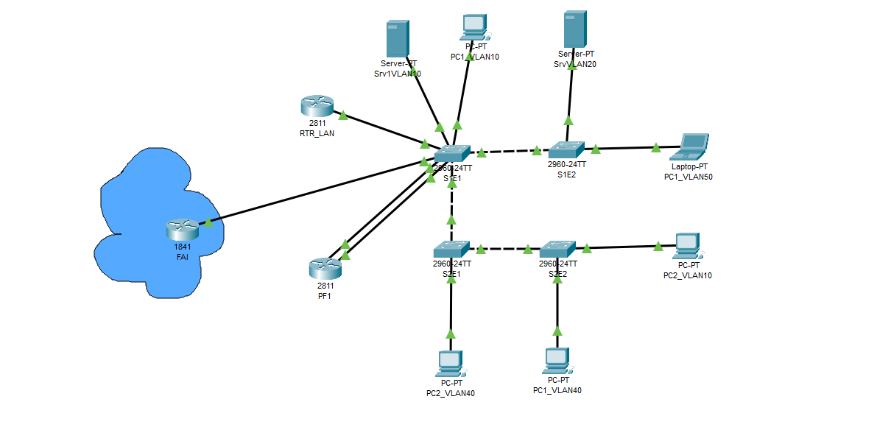
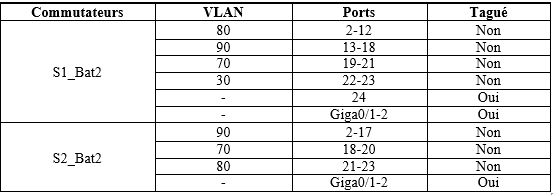

#  Suite VLAN

Schéma logique :

Contexte : Notre ancien lan, sera repris pour y rajouter des VLANS supplémentaires.

Pour mieux  schématiser le contexte les lans seront des des batiments.

Bat1 = lan de base.

Bat2 = Les configurations supplémentaires.

Objectifs : 

•	Adapter les réseaux et le routage existant à l’extension du réseau.

•	Création de VLAN, affectation et routage INTERVLAN.

•	Créer l’archectitecture du nouveau réseau

•	L’ajout de nouveaux commutateurs doit-être facilité…

•	La reconfiguration en cas de changement de matériel doit-être rapide.

•	Gérer le DHCP sur l’ensemble des réseaux.

## I. Agrandissement du réseau 

Pour cet agrandissement nous aurons besoins des VLANS suivants :

1. 90 VoIP.

2. 70 Imprimerie.

3. 80 Serveurs Impression.

4. 30 InterRTR -> devra être le m^me VLAN que celui déjà existant dans le Bât1.

Configuration du bat2 :

- 2 commutateurs 24 ports 2960.

- routeur 2811 indépendant qui routera les VLANS de ce bâtiment.

L'ensemble devra communiquer avec tout le reste des réseaux existant et accéder à Internet via le PareFeu existant.

Répartition des ports :

