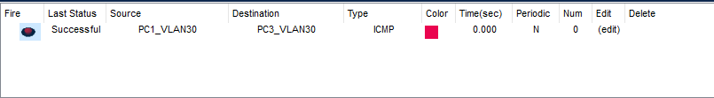

#  Suite VLAN

Schéma logique :


Contexte : Notre ancien lan, sera repris pour y rajouter des VLANS supplémentaires.

Pour mieux  schématiser le contexte les lans seront des des batiments.

Bat1 = lan de base.

Bat2 = Les configurations supplémentaires.

Objectifs : 

•	Adapter les réseaux et le routage existant à l’extension du réseau.

•	Création de VLAN, affectation et routage INTERVLAN.

•	Créer l’archectitecture du nouveau réseau

•	L’ajout de nouveaux commutateurs doit-être facilité…

•	La reconfiguration en cas de changement de matériel doit-être rapide.

•	Gérer le DHCP sur l’ensemble des réseaux.

## I. Agrandissement du réseau 


Pour cet agrandissement nous aurons besoins des VLANS suivants :

1. 90 VoIP.

2. 70 Imprimerie.

3. 80 Serveurs Impression.

4. 30 InterRTR -> devra être le m^me VLAN que celui déjà existant dans le Bât1.

Configuration du bat2 :

- 2 commutateurs 24 ports 2960.

- routeur 2811 indépendant qui routera les VLANS de ce bâtiment.

L'ensemble devra communiquer avec tout le reste des réseaux existant et accéder à Internet via le PareFeu existant.


Répartition des ports :


Configuration du switch S1_BAT2 après la création des Vlans :


Sur le routeur je crée les sous interfaces pour mes différents Vlans :


Les machines test :


Schéma logique final :


Tests des communications :

PC1_VLAN30 -> PC3_VLAN30 :



PC1_VLAN90 -> PC2_VLAN90 :


## Administration et automatisation

Il arrive qu'un administrateur change son matériels, dans cette situation, il est important de prévoir une sauvegarde de configuration avec le protocole TFTP pour pourvoir faire une restauration.

La configuaration de ces services se fait sur une machine "serveur" :


La commande our sauvegarder :

```sh
copy  startup-config  tftp 
```

L'ensemble des machines du réseau du vlan 10 devront être adressé en DHCP via un serveur :


Pour la distribution d'adresses, le routeur sera mon relais DHCP. 

Pour cela il est nécessaire de choisir les interfaces sur le routeur que l'on souhaite configurer :

```sh
interface Fa numSousInterface
```

```sh
ip helper-address ipPasserelle
```


L’ajout de nouveaux commutateurs nécessite à chaque fois de créer tous les VLANs sur le matériel. Pour éviter cela, nous devons utiliser le protocole VTP(propriétaire Cisco) qui permet de transmettre les vlans sur tous les commutateurs.

Le commutateur S1E1 est mon commutateur principal, je vais ajouté un nouveau vlan :


configuration du protocole vtp sur le switch principal :


Sur un switch client S2E2, je pense bien à le mettre en mode transparant avant:


