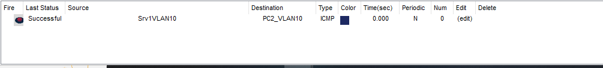

#  VLAN

VLAN : Un VLAN est un sous réseau  virtuel logique,permettant de réduire le domaine de diffusion et ainsi mieux segmenter le réseau.

## Introduction 

Pour l'introduction au routage inter Vlan un lan a rapidement été crée.

Le contexte :


Sur packet tracer :


Le port Fa0/24 de S1E1 permet de relier le routeur RTR_LAN port FA 0/0.

Le routeur PF1 est relié sur les ports de S1E1 dans le VLAN 30 et le VLAN 60.

## L’environnement CLI (console line interface)

Les différentes commandes pour configurer les vlans sur les switchs de niveau 2 seront faîtes via l'OS du switch(IOS) un terminal dans l'onglet CLI est mis à notre disposition.

CLI :


il y a 2 status :

Utilisateur simple prompt = > 

Super-utilisateur prompt = #

Pour passer en mode super-utilisateur il faut taper la commande en.

Pour vérifier la version du matériel je la show version :


Sur les appareils Cisco les configs se font toujours depuis le mode config et ses sous modes.

certaines commandes marchent qu'en "enable" ex show.

pour enlever une commande, il suffit d'utiliser ma commande no suivie de la commande à retirer.


je suis d'abord passé en mode super-utilisateur, j'ai ensuite activé le mode terminal.

pour changer le nom de l'appareil je tape la commande hostname suivi du futur nom.

Pour protéger le mode enable, il est nécessaire de mettre un mot de passe chiffré avec la commande enable secret le mot de passe.


Je configure mes appareils pour ne plus faire apparaître les logs à l'écran et pour éviter une recherche DNS extérieur systématique (en cas d'erreur de commandes) :


Je pense bien évidemment à redémarrer le switch, pour sauvegarder les modifications :


## Création des VLANS

Depuis l'invite de commande CLI, pour créer un vlan je tape les commandes suivantes :

```sh
vlan numDuVLAN
```

```sh
name nomDuVLAN
```


pour supprimer un VLAN :

```sh
no vlan numDuVLAN
```

pour affecter le VLAN à une interface :

```sh
interface Fa idD'interface
```

```sh
switchport mode access 
```

```sh
switchport access vlan numDuVLAN 
```


Il est possible d'affecter plusieurs ports en une fois via les commandes :

```sh
interface range Fa numInterface - numdernièreInterface
```
```sh
switchport mode access 
```

```sh
switchport access vlan numDuVLAN 
```


Dans mon cas, pour la répartition des ports je suit ce tableau :


Sur le switch S1E1 :


## Routage InterVLAN

Les différents switch doivent être reliés entre eux, via un lien tagué car les différents terminaux, relier au switch ne le sont pas et cela fait lors d'une communication entre des machines du même VLAN,  l'identifiant du vlan n'est pas présent dans la trame qu'envoie les terminaux, c'est le switch qui se chargera  d'ajouter l'identifiant du vlan dans la trame. 

Pour créer un lien tagué :

```sh
interface l'interface
```
```sh
switchport mode trunk
```

```sh
switchport trunk allowed vlan numsDesVlans
```


Les VLANS 10, 20, 30, 40, 60 sont autorisés à passer sur le lien tagué crée sur l'interface gigabit 0/1.

La comminication des vlans entre eux, ce fait via l'intermédiare d'un routeur.

Dans mon cas le lien entre le routeur RTR_LAN et le switch S1E1 se fait sur le port 24 du switch.

Pour cela il est nécessaire de créer des sous interfaces virtuelle.

Pour ajouter des sous interfaces au routeur :

```sh
interface Fa sous interface
```

```sh
encapsulation dot1q numVlan
```
```sh
ip address adresseIp masque
```


Il ne faut pas oublier d'activer l’interface physique du routeur.

```sh
interface Fa interface
```

```sh
no shutdown
```


Contexte Final :


Test communication srv1Vlan10 vers PC2_Vlan10 :


